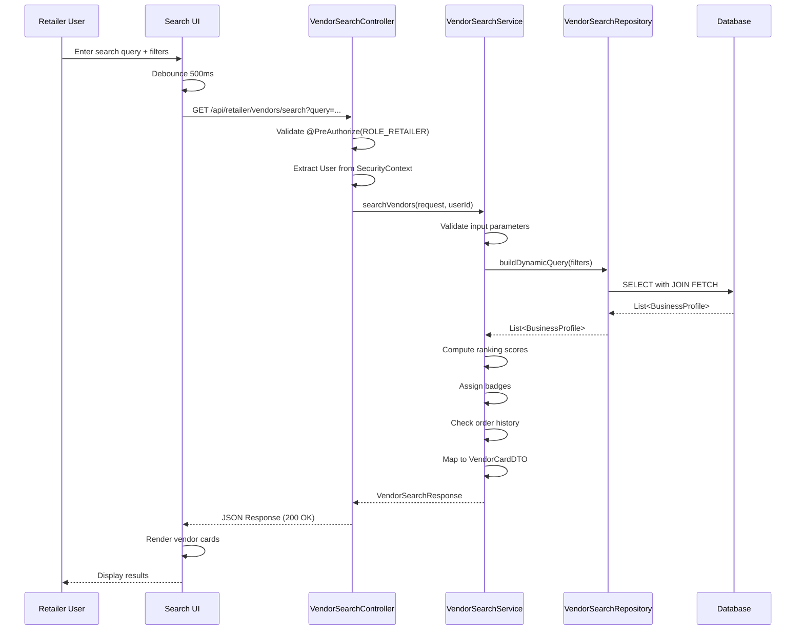
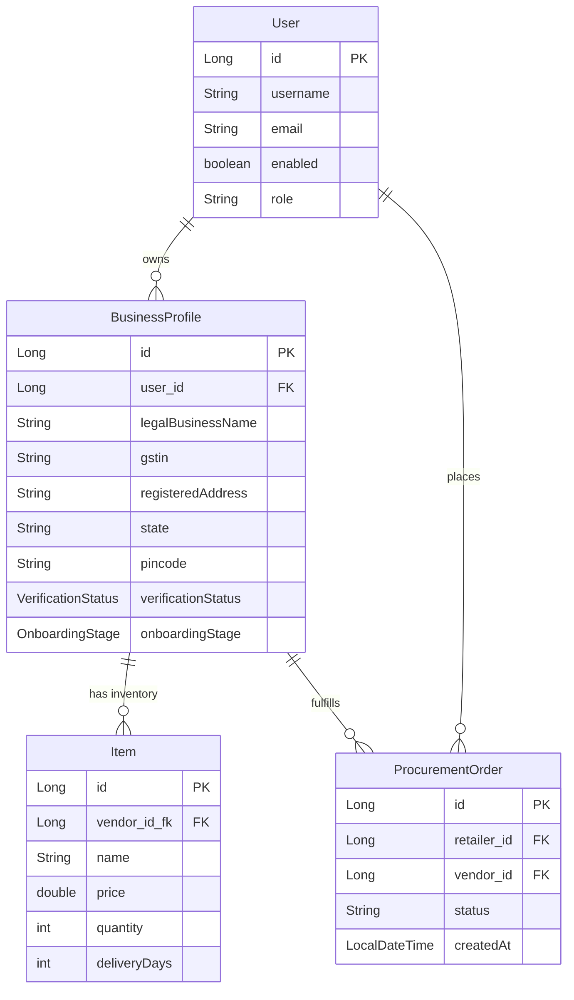

# Design Document: Vendor Search & Recommendation Engine

## Overview

The Vendor Search & Recommendation Engine is a comprehensive search and discovery system that enables retailers to find and evaluate verified vendors based on multiple criteria. This feature replaces the legacy manual vendor addition interface with an intelligent, filterable search system that supports product-based queries, price filtering, delivery time constraints, stock availability checks, and geographic proximity searches.

### Key Capabilities

- **Multi-Criteria Search**: Query by product name or vendor name with case-insensitive matching
- **Advanced Filtering**: Price range, delivery time, minimum stock quantity, geographic distance
- **Intelligent Ranking**: Weighted scoring algorithm combining price, delivery speed, reliability, and stock levels
- **Badge System**: Visual indicators for best price, fast delivery, and high reliability
- **Order History Integration**: Highlights vendors with previous order relationships
- **Pagination Support**: Efficient navigation through large result sets
- **Real-Time UI**: Dynamic search results without page refresh using JavaScript fetch API

### Integration Points

- **BusinessProfile Entity**: Leverages ROLE_VENDOR profiles with VERIFIED status and ACTIVE onboarding stage
- **Item Entity**: Queries inventory records for product matching and pricing
- **User Entity**: Enforces ROLE_RETAILER authorization and tenant isolation
- **Order History**: Tracks previous procurement relationships for personalization
- **Security Layer**: Spring Security with @PreAuthorize annotations and CSRF protection

### Design Principles

1. **Tenant Isolation**: All queries scoped by retailer's business profile context
2. **Performance First**: Database indexes, JOIN FETCH strategies, and query optimization
3. **Extensibility**: Modular ranking algorithm interface for future ML integration
4. **Security**: Role-based access control with multi-tenant data isolation
5. **User Experience**: Responsive UI with debounced inputs and loading states


## Architecture

### High-Level Component Diagram

```mermaid
graph TB
    UI[Thymeleaf UI<br/>retailer/vendor-search.html]
    JS[JavaScript Client<br/>Fetch API + CSRF]
    Controller[RetailerVendorSearchController<br/>@RestController]
    Service[VendorSearchService<br/>Business Logic]
    Ranking[RankingStrategy Interface<br/>Weighted Algorithm]
    Repository[VendorSearchRepository<br/>JPA Criteria API]
    
    DB[(Database<br/>business_profiles<br/>inventory_item<br/>procurement_orders)]
    
    UI -->|User Input| JS
    JS -->|GET /api/retailer/vendors/search| Controller
    Controller -->|Validate & Delegate| Service
    Service -->|Apply Filters| Repository
    Service -->|Compute Scores| Ranking
    Repository -->|Query| DB
    Service -->|Map to DTOs| Controller
    Controller -->|JSON Response| JS
    JS -->|Render Cards| UI
    
    style UI fill:#e1f5ff
    style Controller fill:#fff4e1
    style Service fill:#e8f5e9
    style Repository fill:#f3e5f5
    style DB fill:#fce4ec
```

### Data Flow Sequence



### Layer Responsibilities

#### 1. Presentation Layer (UI)
- **Thymeleaf Template**: `retailer/vendor-search.html`
- **Responsibilities**:
  - Render search bar and filter sidebar
  - Display vendor cards in responsive grid
  - Handle pagination controls
  - Manage loading states and error messages
- **Technologies**: Thymeleaf, Bootstrap 5, JavaScript ES6

#### 2. Controller Layer
- **Class**: `RetailerVendorSearchController`
- **Responsibilities**:
  - Expose REST API endpoint
  - Validate query parameters
  - Enforce security (@PreAuthorize)
  - Map DTOs to JSON responses
  - Handle exceptions and error responses
- **Technologies**: Spring MVC, Spring Security

#### 3. Service Layer
- **Class**: `VendorSearchService` (interface + implementation)
- **Responsibilities**:
  - Orchestrate search workflow
  - Apply business rules
  - Compute ranking scores
  - Assign badges
  - Lookup order history
  - Map entities to DTOs
- **Technologies**: Spring Service, Java Streams

#### 4. Repository Layer
- **Class**: `VendorSearchRepository` (extends JpaRepository)
- **Responsibilities**:
  - Build dynamic queries with JPA Criteria API
  - Apply filters (price, delivery, stock, distance)
  - Use JOIN FETCH to avoid N+1 queries
  - Support pagination
- **Technologies**: Spring Data JPA, JPA Criteria API

#### 5. Data Layer
- **Entities**: BusinessProfile, Item, User, ProcurementOrder
- **Responsibilities**:
  - Persist vendor and inventory data
  - Maintain referential integrity
  - Support multi-tenant isolation
- **Technologies**: JPA, Hibernate, H2/MySQL


## Components and Interfaces

### DTO Design

#### VendorSearchRequest

```java
package com.example.IMS.dto;

import javax.validation.constraints.*;
import java.math.BigDecimal;

/**
 * Request DTO for vendor search with filters and pagination
 * Validates all input parameters before processing
 */
public class VendorSearchRequest {
    
    // Search query
    private String query;  // Product name or vendor name (optional)
    
    // Price filters
    @DecimalMin(value = "0.0", message = "minPrice must be non-negative")
    private BigDecimal minPrice;
    
    @DecimalMin(value = "0.0", message = "maxPrice must be non-negative")
    private BigDecimal maxPrice;
    
    // Delivery filter
    @Min(value = 1, message = "maxDeliveryDays must be at least 1")
    private Integer maxDeliveryDays;
    
    // Stock filter
    @Min(value = 1, message = "minQuantity must be at least 1")
    private Integer minQuantity;
    
    // Distance filter
    @DecimalMin(value = "0.0", message = "maxDistanceKm must be non-negative")
    private BigDecimal maxDistanceKm;
    
    // Verification filter (always true, but explicit)
    private Boolean verifiedOnly = true;
    
    // Sorting
    @Pattern(regexp = "price|delivery|rating|relevance", 
             message = "sortBy must be one of: price, delivery, rating, relevance")
    private String sortBy = "relevance";
    
    @Pattern(regexp = "asc|desc", 
             message = "sortDirection must be one of: asc, desc")
    private String sortDirection;  // Default depends on sortBy
    
    // Pagination
    @Min(value = 0, message = "page must be 0 or greater")
    private Integer page = 0;
    
    @Min(value = 1, message = "size must be at least 1")
    @Max(value = 50, message = "size cannot exceed 50")
    private Integer size = 20;
    
    // Getters and setters...
    
    /**
     * Get effective sort direction based on sortBy
     * Default: asc for price/delivery, desc for rating/relevance
     */
    public String getEffectiveSortDirection() {
        if (sortDirection != null) {
            return sortDirection;
        }
        return ("price".equals(sortBy) || "delivery".equals(sortBy)) ? "asc" : "desc";
    }
    
    /**
     * Validate price range consistency
     */
    public void validatePriceRange() {
        if (minPrice != null && maxPrice != null && minPrice.compareTo(maxPrice) > 0) {
            throw new IllegalArgumentException(
                "Invalid price range: minPrice cannot exceed maxPrice");
        }
    }
}
```

#### VendorSearchResponse

```java
package com.example.IMS.dto;

import java.util.List;

/**
 * Response DTO containing paginated vendor search results
 */
public class VendorSearchResponse {
    
    private List<VendorCardDTO> vendors;
    private int currentPage;
    private int totalPages;
    private long totalElements;
    private int pageSize;
    
    // Constructors
    public VendorSearchResponse() {}
    
    public VendorSearchResponse(List<VendorCardDTO> vendors, 
                               int currentPage, 
                               int totalPages, 
                               long totalElements, 
                               int pageSize) {
        this.vendors = vendors;
        this.currentPage = currentPage;
        this.totalPages = totalPages;
        this.totalElements = totalElements;
        this.pageSize = pageSize;
    }
    
    // Getters and setters...
    
    public boolean hasNext() {
        return currentPage < totalPages - 1;
    }
    
    public boolean hasPrevious() {
        return currentPage > 0;
    }
}
```

#### VendorCardDTO

```java
package com.example.IMS.dto;

import com.example.IMS.model.enums.Badge;
import java.math.BigDecimal;

/**
 * DTO representing a vendor card in search results
 * Contains all information needed for display and decision-making
 */
public class VendorCardDTO {
    
    private Long vendorId;                    // BusinessProfile ID
    private String vendorName;                // legalBusinessName
    private BigDecimal pricePerUnit;          // From Item.price
    private Integer availableQuantity;        // From Item.quantity
    private Integer deliveryDays;             // From vendor metadata
    private Double reliabilityScore;          // Computed from order history (0.0-1.0)
    private Double rating;                    // From review aggregation (0.0-5.0)
    private Boolean verified;                 // Always true (filtered)
    private String location;                  // "City, State" format
    private Boolean previouslyOrdered;        // Order history flag
    private Badge badge;                      // BEST_PRICE, FAST_DELIVERY, HIGH_RELIABILITY, NONE
    
    // Constructors
    public VendorCardDTO() {}
    
    // Builder pattern for easier construction
    public static class Builder {
        private VendorCardDTO dto = new VendorCardDTO();
        
        public Builder vendorId(Long vendorId) {
            dto.vendorId = vendorId;
            return this;
        }
        
        public Builder vendorName(String vendorName) {
            dto.vendorName = vendorName;
            return this;
        }
        
        public Builder pricePerUnit(BigDecimal pricePerUnit) {
            dto.pricePerUnit = pricePerUnit;
            return this;
        }
        
        public Builder availableQuantity(Integer availableQuantity) {
            dto.availableQuantity = availableQuantity;
            return this;
        }
        
        public Builder deliveryDays(Integer deliveryDays) {
            dto.deliveryDays = deliveryDays;
            return this;
        }
        
        public Builder reliabilityScore(Double reliabilityScore) {
            dto.reliabilityScore = reliabilityScore;
            return this;
        }
        
        public Builder rating(Double rating) {
            dto.rating = rating;
            return this;
        }
        
        public Builder verified(Boolean verified) {
            dto.verified = verified;
            return this;
        }
        
        public Builder location(String location) {
            dto.location = location;
            return this;
        }
        
        public Builder previouslyOrdered(Boolean previouslyOrdered) {
            dto.previouslyOrdered = previouslyOrdered;
            return this;
        }
        
        public Builder badge(Badge badge) {
            dto.badge = badge;
            return this;
        }
        
        public VendorCardDTO build() {
            return dto;
        }
    }
    
    // Getters and setters...
    
    /**
     * Format location as "City, State"
     */
    public String getFormattedLocation() {
        return location != null ? location : "Location not specified";
    }
    
    /**
     * Get reliability as percentage for display
     */
    public int getReliabilityPercentage() {
        return reliabilityScore != null ? (int)(reliabilityScore * 100) : 0;
    }
}
```

#### Badge Enum

```java
package com.example.IMS.model.enums;

/**
 * Badge types for highlighting vendor strengths
 */
public enum Badge {
    BEST_PRICE("Best Price", "#28a745"),
    FAST_DELIVERY("Fast Delivery", "#007bff"),
    HIGH_RELIABILITY("High Reliability", "#ffc107"),
    NONE("", "");
    
    private final String displayName;
    private final String colorCode;
    
    Badge(String displayName, String colorCode) {
        this.displayName = displayName;
        this.colorCode = colorCode;
    }
    
    public String getDisplayName() {
        return displayName;
    }
    
    public String getColorCode() {
        return colorCode;
    }
}
```


### Repository Layer Design

#### VendorSearchRepository Interface

```java
package com.example.IMS.repository;

import com.example.IMS.model.BusinessProfile;
import org.springframework.data.domain.Page;
import org.springframework.data.domain.Pageable;
import org.springframework.data.jpa.repository.JpaRepository;
import org.springframework.data.jpa.repository.Query;
import org.springframework.data.repository.query.Param;
import org.springframework.stereotype.Repository;

import java.math.BigDecimal;
import java.util.List;

/**
 * Repository for vendor search operations
 * Uses custom queries with JOIN FETCH to avoid N+1 problems
 */
@Repository
public interface VendorSearchRepository extends JpaRepository<BusinessProfile, Long> {
    
    /**
     * Search vendors with dynamic filtering
     * Uses JPQL with JOIN FETCH for performance
     * 
     * @param query Product name or vendor name (case-insensitive)
     * @param minPrice Minimum price filter (nullable)
     * @param maxPrice Maximum price filter (nullable)
     * @param maxDeliveryDays Maximum delivery days (nullable)
     * @param minQuantity Minimum stock quantity (nullable)
     * @param pageable Pagination parameters
     * @return Page of BusinessProfile entities
     */
    @Query("SELECT DISTINCT bp FROM BusinessProfile bp " +
           "LEFT JOIN FETCH bp.user u " +
           "LEFT JOIN Item i ON i.vendor.id = bp.id " +  // Assuming Item has vendor FK
           "WHERE bp.verificationStatus = 'VERIFIED' " +
           "AND bp.onboardingStage = 'ACTIVE' " +
           "AND u.enabled = true " +
           "AND (:query IS NULL OR " +
           "     LOWER(bp.legalBusinessName) LIKE LOWER(CONCAT('%', :query, '%')) OR " +
           "     LOWER(i.name) LIKE LOWER(CONCAT('%', :query, '%'))) " +
           "AND (:minPrice IS NULL OR i.price >= :minPrice) " +
           "AND (:maxPrice IS NULL OR i.price <= :maxPrice) " +
           "AND (:minQuantity IS NULL OR i.quantity >= :minQuantity)")
    Page<BusinessProfile> searchVendors(
        @Param("query") String query,
        @Param("minPrice") BigDecimal minPrice,
        @Param("maxPrice") BigDecimal maxPrice,
        @Param("minQuantity") Integer minQuantity,
        Pageable pageable
    );
    
    /**
     * Count total matching vendors (for pagination metadata)
     */
    @Query("SELECT COUNT(DISTINCT bp) FROM BusinessProfile bp " +
           "LEFT JOIN Item i ON i.vendor.id = bp.id " +
           "WHERE bp.verificationStatus = 'VERIFIED' " +
           "AND bp.onboardingStage = 'ACTIVE' " +
           "AND bp.user.enabled = true " +
           "AND (:query IS NULL OR " +
           "     LOWER(bp.legalBusinessName) LIKE LOWER(CONCAT('%', :query, '%')) OR " +
           "     LOWER(i.name) LIKE LOWER(CONCAT('%', :query, '%'))) " +
           "AND (:minPrice IS NULL OR i.price >= :minPrice) " +
           "AND (:maxPrice IS NULL OR i.price <= :maxPrice) " +
           "AND (:minQuantity IS NULL OR i.quantity >= :minQuantity)")
    long countMatchingVendors(
        @Param("query") String query,
        @Param("minPrice") BigDecimal minPrice,
        @Param("maxPrice") BigDecimal maxPrice,
        @Param("minQuantity") Integer minQuantity
    );
}
```

**Note**: The above query assumes a direct relationship between Item and BusinessProfile. In the actual implementation, we may need to:
1. Add a `businessProfileId` foreign key to the Item table, OR
2. Use a more complex join through the User entity, OR
3. Create a new VendorInventory entity that links BusinessProfile to Items

#### Alternative: JPA Criteria API Approach

For more dynamic filtering (especially for optional distance calculations), we can use JPA Criteria API:

```java
package com.example.IMS.repository;

import com.example.IMS.dto.VendorSearchRequest;
import com.example.IMS.model.BusinessProfile;
import org.springframework.data.domain.Page;
import org.springframework.data.domain.PageImpl;
import org.springframework.data.domain.Pageable;
import org.springframework.stereotype.Repository;

import javax.persistence.EntityManager;
import javax.persistence.PersistenceContext;
import javax.persistence.TypedQuery;
import javax.persistence.criteria.*;
import java.util.ArrayList;
import java.util.List;

/**
 * Custom repository implementation using JPA Criteria API
 * Provides dynamic query building for complex search scenarios
 */
@Repository
public class VendorSearchRepositoryImpl {
    
    @PersistenceContext
    private EntityManager entityManager;
    
    /**
     * Build and execute dynamic vendor search query
     */
    public Page<BusinessProfile> searchVendorsDynamic(
            VendorSearchRequest request, 
            Pageable pageable) {
        
        CriteriaBuilder cb = entityManager.getCriteriaBuilder();
        CriteriaQuery<BusinessProfile> query = cb.createQuery(BusinessProfile.class);
        Root<BusinessProfile> bp = query.from(BusinessProfile.class);
        
        // JOIN FETCH to avoid N+1
        bp.fetch("user", JoinType.LEFT);
        
        // Build predicates
        List<Predicate> predicates = new ArrayList<>();
        
        // Always filter verified and active vendors
        predicates.add(cb.equal(bp.get("verificationStatus"), "VERIFIED"));
        predicates.add(cb.equal(bp.get("onboardingStage"), "ACTIVE"));
        predicates.add(cb.equal(bp.get("user").get("enabled"), true));
        
        // Query filter (product name or vendor name)
        if (request.getQuery() != null && !request.getQuery().isEmpty()) {
            String queryPattern = "%" + request.getQuery().toLowerCase() + "%";
            Predicate vendorNameMatch = cb.like(
                cb.lower(bp.get("legalBusinessName")), queryPattern);
            // TODO: Add product name matching via Item join
            predicates.add(vendorNameMatch);
        }
        
        // Apply all predicates
        query.where(cb.and(predicates.toArray(new Predicate[0])));
        
        // Execute query with pagination
        TypedQuery<BusinessProfile> typedQuery = entityManager.createQuery(query);
        typedQuery.setFirstResult((int) pageable.getOffset());
        typedQuery.setMaxResults(pageable.getPageSize());
        
        List<BusinessProfile> results = typedQuery.getResultList();
        
        // Count total results
        long total = countVendorsDynamic(request);
        
        return new PageImpl<>(results, pageable, total);
    }
    
    /**
     * Count total matching vendors for pagination
     */
    private long countVendorsDynamic(VendorSearchRequest request) {
        CriteriaBuilder cb = entityManager.getCriteriaBuilder();
        CriteriaQuery<Long> countQuery = cb.createQuery(Long.class);
        Root<BusinessProfile> bp = countQuery.from(BusinessProfile.class);
        
        // Build same predicates as search query
        List<Predicate> predicates = new ArrayList<>();
        predicates.add(cb.equal(bp.get("verificationStatus"), "VERIFIED"));
        predicates.add(cb.equal(bp.get("onboardingStage"), "ACTIVE"));
        predicates.add(cb.equal(bp.get("user").get("enabled"), true));
        
        if (request.getQuery() != null && !request.getQuery().isEmpty()) {
            String queryPattern = "%" + request.getQuery().toLowerCase() + "%";
            predicates.add(cb.like(cb.lower(bp.get("legalBusinessName")), queryPattern));
        }
        
        countQuery.select(cb.count(bp));
        countQuery.where(cb.and(predicates.toArray(new Predicate[0])));
        
        return entityManager.createQuery(countQuery).getSingleResult();
    }
}
```


### Service Layer Design

#### VendorSearchService Interface

```java
package com.example.IMS.service;

import com.example.IMS.dto.VendorSearchRequest;
import com.example.IMS.dto.VendorSearchResponse;

/**
 * Service interface for vendor search operations
 */
public interface VendorSearchService {
    
    /**
     * Search for vendors based on criteria
     * 
     * @param request Search request with filters and pagination
     * @param userId Authenticated retailer user ID
     * @return Paginated search response with vendor cards
     */
    VendorSearchResponse searchVendors(VendorSearchRequest request, Long userId);
}
```

#### VendorSearchServiceImpl

```java
package com.example.IMS.service;

import com.example.IMS.dto.*;
import com.example.IMS.model.BusinessProfile;
import com.example.IMS.model.enums.Badge;
import com.example.IMS.repository.VendorSearchRepository;
import com.example.IMS.repository.ProcurementOrderRepository;
import org.slf4j.Logger;
import org.slf4j.LoggerFactory;
import org.springframework.beans.factory.annotation.Autowired;
import org.springframework.data.domain.Page;
import org.springframework.data.domain.PageRequest;
import org.springframework.data.domain.Pageable;
import org.springframework.data.domain.Sort;
import org.springframework.stereotype.Service;
import org.springframework.transaction.annotation.Transactional;

import java.math.BigDecimal;
import java.util.*;
import java.util.stream.Collectors;

/**
 * Implementation of vendor search service
 * Handles search orchestration, ranking, and badge assignment
 */
@Service
@Transactional(readOnly = true)
public class VendorSearchServiceImpl implements VendorSearchService {
    
    private static final Logger logger = LoggerFactory.getLogger(VendorSearchServiceImpl.class);
    
    @Autowired
    private VendorSearchRepository vendorSearchRepository;
    
    @Autowired
    private ProcurementOrderRepository orderRepository;
    
    @Autowired
    private RankingStrategy rankingStrategy;
    
    @Override
    public VendorSearchResponse searchVendors(VendorSearchRequest request, Long userId) {
        logger.info("Searching vendors for user {} with query: {}", userId, request.getQuery());
        
        // Validate request
        request.validatePriceRange();
        
        // Build pageable with sorting
        Pageable pageable = buildPageable(request);
        
        // Execute search query
        Page<BusinessProfile> vendorPage = vendorSearchRepository.searchVendors(
            request.getQuery(),
            request.getMinPrice(),
            request.getMaxPrice(),
            request.getMinQuantity(),
            pageable
        );
        
        // Convert to DTOs
        List<VendorCardDTO> vendorCards = vendorPage.getContent().stream()
            .map(bp -> mapToVendorCard(bp, userId))
            .collect(Collectors.toList());
        
        // Apply ranking if sortBy is "relevance"
        if ("relevance".equals(request.getSortBy())) {
            vendorCards = rankingStrategy.rankVendors(vendorCards);
        }
        
        // Assign badges
        assignBadges(vendorCards);
        
        // Build response
        VendorSearchResponse response = new VendorSearchResponse(
            vendorCards,
            vendorPage.getNumber(),
            vendorPage.getTotalPages(),
            vendorPage.getTotalElements(),
            vendorPage.getSize()
        );
        
        logger.info("Found {} vendors for user {}", vendorCards.size(), userId);
        return response;
    }
    
    /**
     * Build Pageable with sorting configuration
     */
    private Pageable buildPageable(VendorSearchRequest request) {
        Sort sort;
        String sortBy = request.getSortBy();
        String direction = request.getEffectiveSortDirection();
        
        switch (sortBy) {
            case "price":
                sort = Sort.by(Sort.Direction.fromString(direction), "price");
                break;
            case "delivery":
                sort = Sort.by(Sort.Direction.fromString(direction), "deliveryDays");
                break;
            case "rating":
                sort = Sort.by(Sort.Direction.fromString(direction), "rating");
                break;
            case "relevance":
            default:
                // Relevance sorting done in-memory after ranking
                sort = Sort.unsorted();
                break;
        }
        
        return PageRequest.of(request.getPage(), request.getSize(), sort);
    }
    
    /**
     * Map BusinessProfile entity to VendorCardDTO
     */
    private VendorCardDTO mapToVendorCard(BusinessProfile bp, Long retailerUserId) {
        // TODO: Get actual item data - this is placeholder logic
        // In real implementation, we need to join with Item entity
        
        return new VendorCardDTO.Builder()
            .vendorId(bp.getId())
            .vendorName(bp.getLegalBusinessName())
            .pricePerUnit(BigDecimal.valueOf(100.00))  // TODO: Get from Item
            .availableQuantity(50)  // TODO: Get from Item
            .deliveryDays(5)  // TODO: Get from vendor metadata
            .reliabilityScore(0.85)  // TODO: Compute from order history
            .rating(4.5)  // TODO: Get from review aggregation
            .verified(true)
            .location(formatLocation(bp))
            .previouslyOrdered(hasPreviousOrders(bp.getId(), retailerUserId))
            .badge(Badge.NONE)  // Will be assigned later
            .build();
    }
    
    /**
     * Format location as "City, State"
     */
    private String formatLocation(BusinessProfile bp) {
        // Extract city from registeredAddress (simplified)
        String address = bp.getRegisteredAddress();
        String state = bp.getState();
        
        // TODO: Parse city from address properly
        return "City, " + state;
    }
    
    /**
     * Check if retailer has previous orders with vendor
     */
    private boolean hasPreviousOrders(Long vendorId, Long retailerUserId) {
        // TODO: Query ProcurementOrder table
        // For now, return false as placeholder
        return false;
    }
    
    /**
     * Assign badges to top vendors in each category
     */
    private void assignBadges(List<VendorCardDTO> vendors) {
        if (vendors.isEmpty()) {
            return;
        }
        
        // Find best price
        VendorCardDTO bestPrice = vendors.stream()
            .min(Comparator.comparing(VendorCardDTO::getPricePerUnit))
            .orElse(null);
        if (bestPrice != null) {
            bestPrice.setBadge(Badge.BEST_PRICE);
        }
        
        // Find fastest delivery
        VendorCardDTO fastestDelivery = vendors.stream()
            .min(Comparator.comparing(VendorCardDTO::getDeliveryDays))
            .orElse(null);
        if (fastestDelivery != null && !fastestDelivery.equals(bestPrice)) {
            fastestDelivery.setBadge(Badge.FAST_DELIVERY);
        }
        
        // Find highest reliability
        VendorCardDTO highestReliability = vendors.stream()
            .max(Comparator.comparing(VendorCardDTO::getReliabilityScore))
            .orElse(null);
        if (highestReliability != null && 
            !highestReliability.equals(bestPrice) && 
            !highestReliability.equals(fastestDelivery)) {
            highestReliability.setBadge(Badge.HIGH_RELIABILITY);
        }
    }
}
```

#### RankingStrategy Interface

```java
package com.example.IMS.service.ranking;

import com.example.IMS.dto.VendorCardDTO;
import java.util.List;

/**
 * Strategy interface for vendor ranking algorithms
 * Allows swapping between default weighted scoring and ML-based ranking
 */
public interface RankingStrategy {
    
    /**
     * Rank vendors by relevance score
     * 
     * @param vendors List of vendor cards to rank
     * @return Sorted list with highest relevance first
     */
    List<VendorCardDTO> rankVendors(List<VendorCardDTO> vendors);
}
```

#### WeightedRankingStrategy

```java
package com.example.IMS.service.ranking;

import com.example.IMS.dto.VendorCardDTO;
import org.springframework.stereotype.Component;

import java.math.BigDecimal;
import java.util.Comparator;
import java.util.List;
import java.util.stream.Collectors;

/**
 * Default ranking strategy using weighted scoring
 * Formula: 0.35*priceScore + 0.25*deliveryScore + 0.25*reliabilityScore + 0.15*stockScore
 */
@Component
public class WeightedRankingStrategy implements RankingStrategy {
    
    private static final double PRICE_WEIGHT = 0.35;
    private static final double DELIVERY_WEIGHT = 0.25;
    private static final double RELIABILITY_WEIGHT = 0.25;
    private static final double STOCK_WEIGHT = 0.15;
    
    @Override
    public List<VendorCardDTO> rankVendors(List<VendorCardDTO> vendors) {
        if (vendors.isEmpty()) {
            return vendors;
        }
        
        // Find min/max for normalization
        BigDecimal minPrice = vendors.stream()
            .map(VendorCardDTO::getPricePerUnit)
            .min(BigDecimal::compareTo)
            .orElse(BigDecimal.ZERO);
        BigDecimal maxPrice = vendors.stream()
            .map(VendorCardDTO::getPricePerUnit)
            .max(BigDecimal::compareTo)
            .orElse(BigDecimal.ZERO);
        
        int minDelivery = vendors.stream()
            .mapToInt(VendorCardDTO::getDeliveryDays)
            .min()
            .orElse(0);
        int maxDelivery = vendors.stream()
            .mapToInt(VendorCardDTO::getDeliveryDays)
            .max()
            .orElse(0);
        
        int minStock = vendors.stream()
            .mapToInt(VendorCardDTO::getAvailableQuantity)
            .min()
            .orElse(0);
        int maxStock = vendors.stream()
            .mapToInt(VendorCardDTO::getAvailableQuantity)
            .max()
            .orElse(0);
        
        // Compute scores and sort
        return vendors.stream()
            .sorted(Comparator.comparingDouble(v -> 
                -computeRelevanceScore(v, minPrice, maxPrice, minDelivery, maxDelivery, minStock, maxStock)))
            .collect(Collectors.toList());
    }
    
    /**
     * Compute relevance score for a vendor
     */
    private double computeRelevanceScore(
            VendorCardDTO vendor,
            BigDecimal minPrice, BigDecimal maxPrice,
            int minDelivery, int maxDelivery,
            int minStock, int maxStock) {
        
        double priceScore = normalizePrice(vendor.getPricePerUnit(), minPrice, maxPrice);
        double deliveryScore = normalizeDelivery(vendor.getDeliveryDays(), minDelivery, maxDelivery);
        double reliabilityScore = vendor.getReliabilityScore();
        double stockScore = normalizeStock(vendor.getAvailableQuantity(), minStock, maxStock);
        
        return (PRICE_WEIGHT * priceScore) +
               (DELIVERY_WEIGHT * deliveryScore) +
               (RELIABILITY_WEIGHT * reliabilityScore) +
               (STOCK_WEIGHT * stockScore);
    }
    
    /**
     * Normalize price (lower is better, so invert)
     */
    private double normalizePrice(BigDecimal price, BigDecimal min, BigDecimal max) {
        if (max.equals(min)) {
            return 0.5;  // All prices equal
        }
        double normalized = price.subtract(min)
            .divide(max.subtract(min), 4, BigDecimal.ROUND_HALF_UP)
            .doubleValue();
        return 1.0 - normalized;  // Invert so lower price = higher score
    }
    
    /**
     * Normalize delivery (lower is better, so invert)
     */
    private double normalizeDelivery(int delivery, int min, int max) {
        if (max == min) {
            return 0.5;
        }
        double normalized = (double)(delivery - min) / (max - min);
        return 1.0 - normalized;  // Invert so faster delivery = higher score
    }
    
    /**
     * Normalize stock (higher is better)
     */
    private double normalizeStock(int stock, int min, int max) {
        if (max == min) {
            return 0.5;
        }
        return (double)(stock - min) / (max - min);
    }
}
```


### Controller Layer Design

#### RetailerVendorSearchController

```java
package com.example.IMS.controller;

import com.example.IMS.dto.VendorSearchRequest;
import com.example.IMS.dto.VendorSearchResponse;
import com.example.IMS.model.User;
import com.example.IMS.service.VendorSearchService;
import org.slf4j.Logger;
import org.slf4j.LoggerFactory;
import org.springframework.beans.factory.annotation.Autowired;
import org.springframework.http.HttpStatus;
import org.springframework.http.ResponseEntity;
import org.springframework.security.access.prepost.PreAuthorize;
import org.springframework.security.core.Authentication;
import org.springframework.security.core.context.SecurityContextHolder;
import org.springframework.validation.annotation.Validated;
import org.springframework.web.bind.annotation.*;

import javax.validation.Valid;
import java.util.HashMap;
import java.util.Map;

/**
 * REST Controller for vendor search operations
 * Restricted to ROLE_RETAILER users
 */
@RestController
@RequestMapping("/api/retailer/vendors")
@PreAuthorize("hasAuthority('ROLE_RETAILER')")
@Validated
public class RetailerVendorSearchController {
    
    private static final Logger logger = LoggerFactory.getLogger(RetailerVendorSearchController.class);
    
    @Autowired
    private VendorSearchService vendorSearchService;
    
    /**
     * Search for vendors with filters and pagination
     * 
     * GET /api/retailer/vendors/search
     * 
     * Query Parameters:
     * - query: Product name or vendor name (optional)
     * - minPrice: Minimum price filter (optional)
     * - maxPrice: Maximum price filter (optional)
     * - minQuantity: Minimum stock quantity (optional)
     * - maxDeliveryDays: Maximum delivery days (optional)
     * - maxDistanceKm: Maximum distance in km (optional)
     * - verifiedOnly: Only verified vendors (default: true)
     * - sortBy: Sort field (price|delivery|rating|relevance, default: relevance)
     * - sortDirection: Sort direction (asc|desc, default: depends on sortBy)
     * - page: Page number (default: 0)
     * - size: Page size (default: 20, max: 50)
     * 
     * @param request Search request with filters
     * @return VendorSearchResponse with paginated results
     */
    @GetMapping("/search")
    public ResponseEntity<VendorSearchResponse> searchVendors(
            @Valid @ModelAttribute VendorSearchRequest request) {
        
        try {
            // Get authenticated user
            User user = getCurrentUser();
            logger.info("Vendor search request from user: {} with query: {}", 
                       user.getId(), request.getQuery());
            
            // Execute search
            VendorSearchResponse response = vendorSearchService.searchVendors(request, user.getId());
            
            // Log analytics
            logger.info("Search completed: {} results for user {}", 
                       response.getTotalElements(), user.getId());
            
            return ResponseEntity.ok(response);
            
        } catch (IllegalArgumentException e) {
            logger.warn("Invalid search request: {}", e.getMessage());
            return ResponseEntity.badRequest().build();
        } catch (Exception e) {
            logger.error("Error processing vendor search", e);
            return ResponseEntity.status(HttpStatus.INTERNAL_SERVER_ERROR).build();
        }
    }
    
    /**
     * Exception handler for validation errors
     */
    @ExceptionHandler(org.springframework.web.bind.MethodArgumentNotValidException.class)
    public ResponseEntity<Map<String, String>> handleValidationErrors(
            org.springframework.web.bind.MethodArgumentNotValidException ex) {
        
        Map<String, String> errors = new HashMap<>();
        ex.getBindingResult().getFieldErrors().forEach(error -> 
            errors.put(error.getField(), error.getDefaultMessage())
        );
        
        logger.warn("Validation errors in search request: {}", errors);
        return ResponseEntity.badRequest().body(errors);
    }
    
    /**
     * Get current authenticated user from security context
     */
    private User getCurrentUser() {
        Authentication auth = SecurityContextHolder.getContext().getAuthentication();
        return (User) auth.getPrincipal();
    }
}
```

#### UI Controller for Search Page

```java
package com.example.IMS.controller;

import com.example.IMS.model.User;
import org.springframework.security.access.prepost.PreAuthorize;
import org.springframework.security.core.Authentication;
import org.springframework.security.core.context.SecurityContextHolder;
import org.springframework.stereotype.Controller;
import org.springframework.ui.Model;
import org.springframework.web.bind.annotation.GetMapping;
import org.springframework.web.bind.annotation.RequestMapping;

/**
 * Controller for vendor search UI page
 */
@Controller
@RequestMapping("/retailer")
@PreAuthorize("hasAuthority('ROLE_RETAILER')")
public class RetailerVendorSearchPageController {
    
    /**
     * Display vendor search page
     * 
     * GET /retailer/vendor-search
     */
    @GetMapping("/vendor-search")
    public String vendorSearchPage(Model model) {
        User user = getCurrentUser();
        model.addAttribute("user", user);
        return "retailer/vendor-search";
    }
    
    private User getCurrentUser() {
        Authentication auth = SecurityContextHolder.getContext().getAuthentication();
        return (User) auth.getPrincipal();
    }
}
```


## Data Models

### Entity Relationships



### Database Schema Considerations

#### Required Indexes

To support efficient vendor search queries, the following indexes are required:

```sql
-- BusinessProfile indexes
CREATE INDEX idx_bp_verification_status ON business_profiles(verification_status);
CREATE INDEX idx_bp_onboarding_stage ON business_profiles(onboarding_stage);
CREATE INDEX idx_bp_user_enabled ON business_profiles(user_id);

-- Item indexes (for product search)
CREATE INDEX idx_item_name ON inventory_item(item_name);
CREATE INDEX idx_item_price ON inventory_item(item_price);
CREATE INDEX idx_item_quantity ON inventory_item(item_quantity);
CREATE INDEX idx_item_vendor ON inventory_item(vendor_id_fk);

-- User indexes
CREATE INDEX idx_user_enabled ON users(enabled);

-- ProcurementOrder indexes (for order history lookup)
CREATE INDEX idx_order_retailer_vendor ON procurement_orders(retailer_id, vendor_id);
CREATE INDEX idx_order_status ON procurement_orders(status);

-- Composite index for common search patterns
CREATE INDEX idx_bp_search ON business_profiles(verification_status, onboarding_stage, user_id);
```

#### Schema Modifications Needed

**Option 1: Add businessProfileId to Item table**

```sql
ALTER TABLE inventory_item 
ADD COLUMN business_profile_id BIGINT,
ADD CONSTRAINT fk_item_business_profile 
    FOREIGN KEY (business_profile_id) 
    REFERENCES business_profiles(id);

CREATE INDEX idx_item_business_profile ON inventory_item(business_profile_id);
```

**Option 2: Create VendorInventory junction table**

```sql
CREATE TABLE vendor_inventory (
    id BIGINT PRIMARY KEY AUTO_INCREMENT,
    business_profile_id BIGINT NOT NULL,
    item_id BIGINT NOT NULL,
    delivery_days INT DEFAULT 7,
    reliability_score DOUBLE DEFAULT 0.0,
    rating DOUBLE DEFAULT 0.0,
    created_at TIMESTAMP DEFAULT CURRENT_TIMESTAMP,
    updated_at TIMESTAMP DEFAULT CURRENT_TIMESTAMP ON UPDATE CURRENT_TIMESTAMP,
    FOREIGN KEY (business_profile_id) REFERENCES business_profiles(id),
    FOREIGN KEY (item_id) REFERENCES inventory_item(item_id),
    UNIQUE KEY uk_vendor_item (business_profile_id, item_id)
);

CREATE INDEX idx_vendor_inv_bp ON vendor_inventory(business_profile_id);
CREATE INDEX idx_vendor_inv_item ON vendor_inventory(item_id);
```

**Option 3: Add vendor metadata columns to BusinessProfile**

```sql
ALTER TABLE business_profiles
ADD COLUMN default_delivery_days INT DEFAULT 7,
ADD COLUMN reliability_score DOUBLE DEFAULT 0.0,
ADD COLUMN rating DOUBLE DEFAULT 0.0,
ADD COLUMN total_orders INT DEFAULT 0,
ADD COLUMN completed_orders INT DEFAULT 0;
```

**Recommended Approach**: Use Option 2 (VendorInventory junction table) for maximum flexibility and proper separation of concerns.


## UI Design

### Thymeleaf Template Structure

#### retailer/vendor-search.html

```html
<!DOCTYPE html>
<html xmlns:th="http://www.thymeleaf.org"
      xmlns:sec="http://www.thymeleaf.org/extras/spring-security">
<head>
    <meta charset="UTF-8">
    <meta name="viewport" content="width=device-width, initial-scale=1.0">
    <meta name="_csrf" th:content="${_csrf.token}"/>
    <meta name="_csrf_header" th:content="${_csrf.headerName}"/>
    <title>Vendor Search - FlowTrack</title>
    
    <!-- Bootstrap 5 CSS -->
    <link href="https://cdn.jsdelivr.net/npm/bootstrap@5.3.0/dist/css/bootstrap.min.css" rel="stylesheet">
    <!-- Font Awesome -->
    <link rel="stylesheet" href="https://cdnjs.cloudflare.com/ajax/libs/font-awesome/6.4.0/css/all.min.css">
    <!-- Custom CSS -->
    <link rel="stylesheet" th:href="@{/css/vendor-search.css}">
</head>
<body>
    <!-- Navigation Bar -->
    <nav th:replace="fragments/navbar :: navbar"></nav>
    
    <div class="container-fluid mt-4">
        <div class="row">
            <!-- Left Sidebar: Filters -->
            <div class="col-md-3">
                <div class="card shadow-sm">
                    <div class="card-header bg-primary text-white">
                        <h5 class="mb-0"><i class="fas fa-filter"></i> Filters</h5>
                    </div>
                    <div class="card-body">
                        <form id="filterForm">
                            <!-- Price Range Filter -->
                            <div class="mb-3">
                                <label class="form-label fw-bold">Price Range (₹)</label>
                                <div class="row g-2">
                                    <div class="col-6">
                                        <input type="number" class="form-control form-control-sm" 
                                               id="minPrice" name="minPrice" placeholder="Min" min="0" step="0.01">
                                    </div>
                                    <div class="col-6">
                                        <input type="number" class="form-control form-control-sm" 
                                               id="maxPrice" name="maxPrice" placeholder="Max" min="0" step="0.01">
                                    </div>
                                </div>
                            </div>
                            
                            <!-- Delivery Time Filter -->
                            <div class="mb-3">
                                <label for="maxDeliveryDays" class="form-label fw-bold">
                                    Max Delivery Days
                                </label>
                                <input type="number" class="form-control form-control-sm" 
                                       id="maxDeliveryDays" name="maxDeliveryDays" 
                                       placeholder="e.g., 7" min="1">
                            </div>
                            
                            <!-- Minimum Stock Filter -->
                            <div class="mb-3">
                                <label for="minQuantity" class="form-label fw-bold">
                                    Minimum Stock
                                </label>
                                <input type="number" class="form-control form-control-sm" 
                                       id="minQuantity" name="minQuantity" 
                                       placeholder="e.g., 100" min="1">
                            </div>
                            
                            <!-- Distance Filter -->
                            <div class="mb-3">
                                <label for="maxDistanceKm" class="form-label fw-bold">
                                    Max Distance (km)
                                </label>
                                <input type="number" class="form-control form-control-sm" 
                                       id="maxDistanceKm" name="maxDistanceKm" 
                                       placeholder="e.g., 50" min="0" step="0.1">
                            </div>
                            
                            <!-- Sort Options -->
                            <div class="mb-3">
                                <label for="sortBy" class="form-label fw-bold">Sort By</label>
                                <select class="form-select form-select-sm" id="sortBy" name="sortBy">
                                    <option value="relevance" selected>Relevance</option>
                                    <option value="price">Price</option>
                                    <option value="delivery">Delivery Time</option>
                                    <option value="rating">Rating</option>
                                </select>
                            </div>
                            
                            <!-- Sort Direction -->
                            <div class="mb-3">
                                <label for="sortDirection" class="form-label fw-bold">Order</label>
                                <select class="form-select form-select-sm" id="sortDirection" name="sortDirection">
                                    <option value="asc">Ascending</option>
                                    <option value="desc" selected>Descending</option>
                                </select>
                            </div>
                            
                            <!-- Clear Filters Button -->
                            <button type="button" class="btn btn-outline-secondary btn-sm w-100" 
                                    id="clearFilters">
                                <i class="fas fa-times"></i> Clear Filters
                            </button>
                        </form>
                    </div>
                </div>
            </div>
            
            <!-- Main Content: Search and Results -->
            <div class="col-md-9">
                <!-- Search Bar -->
                <div class="card shadow-sm mb-4">
                    <div class="card-body">
                        <div class="input-group">
                            <span class="input-group-text bg-white">
                                <i class="fas fa-search"></i>
                            </span>
                            <input type="text" class="form-control" id="searchQuery" 
                                   placeholder="Search by product name or vendor name..." 
                                   autocomplete="off">
                        </div>
                    </div>
                </div>
                
                <!-- Loading Indicator -->
                <div id="loadingIndicator" class="text-center my-5" style="display: none;">
                    <div class="spinner-border text-primary" role="status">
                        <span class="visually-hidden">Loading...</span>
                    </div>
                    <p class="mt-2 text-muted">Searching vendors...</p>
                </div>
                
                <!-- Results Count -->
                <div id="resultsCount" class="mb-3" style="display: none;">
                    <p class="text-muted">
                        Found <strong id="totalResults">0</strong> vendors
                    </p>
                </div>
                
                <!-- Vendor Cards Grid -->
                <div id="vendorGrid" class="row row-cols-1 row-cols-md-2 row-cols-lg-3 g-4">
                    <!-- Vendor cards will be dynamically inserted here -->
                </div>
                
                <!-- No Results Message -->
                <div id="noResults" class="text-center my-5" style="display: none;">
                    <i class="fas fa-search fa-3x text-muted mb-3"></i>
                    <h5 class="text-muted">No vendors found</h5>
                    <p class="text-muted">Try adjusting your search criteria or filters</p>
                </div>
                
                <!-- Pagination Controls -->
                <nav id="paginationNav" aria-label="Vendor search pagination" style="display: none;">
                    <ul class="pagination justify-content-center mt-4" id="paginationControls">
                        <!-- Pagination buttons will be dynamically inserted here -->
                    </ul>
                </nav>
            </div>
        </div>
    </div>
    
    <!-- Bootstrap 5 JS -->
    <script src="https://cdn.jsdelivr.net/npm/bootstrap@5.3.0/dist/js/bootstrap.bundle.min.js"></script>
    <!-- Custom JS -->
    <script th:src="@{/js/vendor-search.js}"></script>
</body>
</html>
```

### Vendor Card HTML Template (JavaScript)

```javascript
// Template function for rendering vendor cards
function createVendorCard(vendor) {
    const badgeHtml = vendor.badge !== 'NONE' ? 
        `<span class="badge bg-${getBadgeColor(vendor.badge)} position-absolute top-0 end-0 m-2">
            ${vendor.badge.replace('_', ' ')}
        </span>` : '';
    
    const previousOrderHtml = vendor.previouslyOrdered ? 
        `<span class="badge bg-info text-dark">
            <i class="fas fa-history"></i> Previously Ordered
        </span>` : '';
    
    return `
        <div class="col">
            <div class="card h-100 shadow-sm vendor-card" data-vendor-id="${vendor.vendorId}">
                ${badgeHtml}
                <div class="card-body">
                    <h5 class="card-title">
                        ${vendor.vendorName}
                        ${vendor.verified ? '<i class="fas fa-check-circle text-success" title="Verified"></i>' : ''}
                    </h5>
                    
                    <div class="vendor-details">
                        <p class="mb-2">
                            <strong>Price:</strong> 
                            <span class="text-primary fs-5">₹${vendor.pricePerUnit.toFixed(2)}</span> per unit
                        </p>
                        
                        <p class="mb-2">
                            <i class="fas fa-box text-muted"></i>
                            <strong>Stock Available:</strong> ${vendor.availableQuantity} units
                        </p>
                        
                        <p class="mb-2">
                            <i class="fas fa-truck text-muted"></i>
                            <strong>Delivery Time:</strong> ${vendor.deliveryDays} days
                        </p>
                        
                        <p class="mb-2">
                            <i class="fas fa-chart-line text-muted"></i>
                            <strong>Reliability:</strong> ${vendor.reliabilityScore * 100}%
                        </p>
                        
                        <p class="mb-2">
                            <i class="fas fa-star text-warning"></i>
                            <strong>Rating:</strong> ${vendor.rating.toFixed(1)} / 5.0
                        </p>
                        
                        <p class="mb-2">
                            <i class="fas fa-map-marker-alt text-muted"></i>
                            ${vendor.location}
                        </p>
                        
                        ${previousOrderHtml}
                    </div>
                </div>
                
                <div class="card-footer bg-white border-top-0">
                    <div class="d-grid gap-2">
                        <button class="btn btn-primary btn-sm" onclick="viewVendorDetails(${vendor.vendorId})">
                            <i class="fas fa-eye"></i> View Details
                        </button>
                        <button class="btn btn-outline-success btn-sm" onclick="placeOrder(${vendor.vendorId})">
                            <i class="fas fa-shopping-cart"></i> Order Now
                        </button>
                    </div>
                </div>
            </div>
        </div>
    `;
}

function getBadgeColor(badge) {
    switch(badge) {
        case 'BEST_PRICE': return 'success';
        case 'FAST_DELIVERY': return 'primary';
        case 'HIGH_RELIABILITY': return 'warning';
        default: return 'secondary';
    }
}
```


### JavaScript Integration (vendor-search.js)

```javascript
/**
 * Vendor Search JavaScript Module
 * Handles search requests, filter updates, and dynamic UI rendering
 */

// Global state
let currentPage = 0;
let currentFilters = {};
let debounceTimer = null;

// CSRF token for API requests
const csrfToken = document.querySelector('meta[name="_csrf"]').getAttribute('content');
const csrfHeader = document.querySelector('meta[name="_csrf_header"]').getAttribute('content');

// Initialize on page load
document.addEventListener('DOMContentLoaded', function() {
    initializeEventListeners();
    performSearch(); // Initial search with no filters
});

/**
 * Initialize all event listeners
 */
function initializeEventListeners() {
    // Search query input with debouncing
    document.getElementById('searchQuery').addEventListener('input', function(e) {
        clearTimeout(debounceTimer);
        debounceTimer = setTimeout(() => {
            currentPage = 0;
            performSearch();
        }, 500); // 500ms debounce
    });
    
    // Filter inputs
    const filterInputs = ['minPrice', 'maxPrice', 'maxDeliveryDays', 'minQuantity', 
                         'maxDistanceKm', 'sortBy', 'sortDirection'];
    filterInputs.forEach(inputId => {
        document.getElementById(inputId).addEventListener('change', function() {
            currentPage = 0;
            performSearch();
        });
    });
    
    // Clear filters button
    document.getElementById('clearFilters').addEventListener('click', clearFilters);
}

/**
 * Perform vendor search with current filters
 */
function performSearch() {
    // Show loading indicator
    showLoading(true);
    
    // Build query parameters
    const params = buildQueryParams();
    
    // Make API request
    fetch(`/api/retailer/vendors/search?${params}`, {
        method: 'GET',
        headers: {
            'Content-Type': 'application/json',
            [csrfHeader]: csrfToken
        }
    })
    .then(response => {
        if (!response.ok) {
            throw new Error(`HTTP error! status: ${response.status}`);
        }
        return response.json();
    })
    .then(data => {
        renderResults(data);
        showLoading(false);
    })
    .catch(error => {
        console.error('Search error:', error);
        showError('Failed to load vendors. Please try again.');
        showLoading(false);
    });
}

/**
 * Build URL query parameters from form inputs
 */
function buildQueryParams() {
    const params = new URLSearchParams();
    
    // Search query
    const query = document.getElementById('searchQuery').value.trim();
    if (query) {
        params.append('query', query);
    }
    
    // Price filters
    const minPrice = document.getElementById('minPrice').value;
    if (minPrice) {
        params.append('minPrice', minPrice);
    }
    
    const maxPrice = document.getElementById('maxPrice').value;
    if (maxPrice) {
        params.append('maxPrice', maxPrice);
    }
    
    // Delivery filter
    const maxDeliveryDays = document.getElementById('maxDeliveryDays').value;
    if (maxDeliveryDays) {
        params.append('maxDeliveryDays', maxDeliveryDays);
    }
    
    // Stock filter
    const minQuantity = document.getElementById('minQuantity').value;
    if (minQuantity) {
        params.append('minQuantity', minQuantity);
    }
    
    // Distance filter
    const maxDistanceKm = document.getElementById('maxDistanceKm').value;
    if (maxDistanceKm) {
        params.append('maxDistanceKm', maxDistanceKm);
    }
    
    // Sort options
    params.append('sortBy', document.getElementById('sortBy').value);
    params.append('sortDirection', document.getElementById('sortDirection').value);
    
    // Pagination
    params.append('page', currentPage);
    params.append('size', 20);
    
    return params.toString();
}

/**
 * Render search results
 */
function renderResults(data) {
    const vendorGrid = document.getElementById('vendorGrid');
    const noResults = document.getElementById('noResults');
    const resultsCount = document.getElementById('resultsCount');
    
    // Clear previous results
    vendorGrid.innerHTML = '';
    
    if (data.vendors && data.vendors.length > 0) {
        // Show results count
        document.getElementById('totalResults').textContent = data.totalElements;
        resultsCount.style.display = 'block';
        noResults.style.display = 'none';
        
        // Render vendor cards
        data.vendors.forEach(vendor => {
            vendorGrid.innerHTML += createVendorCard(vendor);
        });
        
        // Render pagination
        renderPagination(data);
    } else {
        // Show no results message
        resultsCount.style.display = 'none';
        noResults.style.display = 'block';
        document.getElementById('paginationNav').style.display = 'none';
    }
}

/**
 * Render pagination controls
 */
function renderPagination(data) {
    const paginationNav = document.getElementById('paginationNav');
    const paginationControls = document.getElementById('paginationControls');
    
    if (data.totalPages <= 1) {
        paginationNav.style.display = 'none';
        return;
    }
    
    paginationNav.style.display = 'block';
    paginationControls.innerHTML = '';
    
    // Previous button
    const prevDisabled = data.currentPage === 0;
    paginationControls.innerHTML += `
        <li class="page-item ${prevDisabled ? 'disabled' : ''}">
            <a class="page-link" href="#" onclick="changePage(${data.currentPage - 1}); return false;">
                <i class="fas fa-chevron-left"></i> Previous
            </a>
        </li>
    `;
    
    // Page numbers (show max 10 pages)
    const startPage = Math.max(0, data.currentPage - 5);
    const endPage = Math.min(data.totalPages, startPage + 10);
    
    for (let i = startPage; i < endPage; i++) {
        const active = i === data.currentPage ? 'active' : '';
        paginationControls.innerHTML += `
            <li class="page-item ${active}">
                <a class="page-link" href="#" onclick="changePage(${i}); return false;">
                    ${i + 1}
                </a>
            </li>
        `;
    }
    
    // Next button
    const nextDisabled = data.currentPage >= data.totalPages - 1;
    paginationControls.innerHTML += `
        <li class="page-item ${nextDisabled ? 'disabled' : ''}">
            <a class="page-link" href="#" onclick="changePage(${data.currentPage + 1}); return false;">
                Next <i class="fas fa-chevron-right"></i>
            </a>
        </li>
    `;
}

/**
 * Change page and perform new search
 */
function changePage(page) {
    currentPage = page;
    performSearch();
    window.scrollTo({ top: 0, behavior: 'smooth' });
}

/**
 * Clear all filters
 */
function clearFilters() {
    document.getElementById('searchQuery').value = '';
    document.getElementById('minPrice').value = '';
    document.getElementById('maxPrice').value = '';
    document.getElementById('maxDeliveryDays').value = '';
    document.getElementById('minQuantity').value = '';
    document.getElementById('maxDistanceKm').value = '';
    document.getElementById('sortBy').value = 'relevance';
    document.getElementById('sortDirection').value = 'desc';
    
    currentPage = 0;
    performSearch();
}

/**
 * Show/hide loading indicator
 */
function showLoading(show) {
    document.getElementById('loadingIndicator').style.display = show ? 'block' : 'none';
    document.getElementById('vendorGrid').style.display = show ? 'none' : 'block';
}

/**
 * Show error message
 */
function showError(message) {
    const vendorGrid = document.getElementById('vendorGrid');
    vendorGrid.innerHTML = `
        <div class="col-12">
            <div class="alert alert-danger" role="alert">
                <i class="fas fa-exclamation-triangle"></i> ${message}
            </div>
        </div>
    `;
}

/**
 * View vendor details (navigate to vendor profile page)
 */
function viewVendorDetails(vendorId) {
    window.location.href = `/retailer/vendor/${vendorId}`;
}

/**
 * Place order with vendor (navigate to order creation page)
 */
function placeOrder(vendorId) {
    window.location.href = `/retailer/order/create?vendorId=${vendorId}`;
}
```

### Custom CSS (vendor-search.css)

```css
/**
 * Custom styles for vendor search page
 */

/* Vendor card hover effect */
.vendor-card {
    transition: transform 0.2s ease-in-out, box-shadow 0.2s ease-in-out;
    cursor: pointer;
}

.vendor-card:hover {
    transform: translateY(-5px);
    box-shadow: 0 0.5rem 1rem rgba(0, 0, 0, 0.15) !important;
}

/* Badge positioning */
.vendor-card .badge {
    font-size: 0.75rem;
    padding: 0.35rem 0.65rem;
}

/* Vendor details styling */
.vendor-details p {
    font-size: 0.9rem;
    margin-bottom: 0.5rem;
}

.vendor-details strong {
    color: #495057;
}

/* Filter sidebar styling */
.card-header {
    border-bottom: 2px solid rgba(255, 255, 255, 0.2);
}

/* Search bar focus effect */
#searchQuery:focus {
    border-color: #0d6efd;
    box-shadow: 0 0 0 0.25rem rgba(13, 110, 253, 0.25);
}

/* Pagination styling */
.pagination .page-link {
    color: #0d6efd;
}

.pagination .page-item.active .page-link {
    background-color: #0d6efd;
    border-color: #0d6efd;
}

/* Loading spinner */
.spinner-border {
    width: 3rem;
    height: 3rem;
}

/* Responsive adjustments */
@media (max-width: 768px) {
    .vendor-card {
        margin-bottom: 1rem;
    }
    
    .col-md-3 {
        margin-bottom: 1.5rem;
    }
}

/* Badge colors */
.bg-success {
    background-color: #28a745 !important;
}

.bg-primary {
    background-color: #007bff !important;
}

.bg-warning {
    background-color: #ffc107 !important;
    color: #212529 !important;
}
```


## Error Handling

### Validation Error Handling

#### Input Validation Strategy

1. **Client-Side Validation** (JavaScript)
   - Immediate feedback for invalid inputs
   - Prevent unnecessary API calls
   - Validate numeric ranges, required fields

2. **Server-Side Validation** (Spring Validation)
   - @Valid annotation on DTOs
   - Custom validators for business rules
   - Comprehensive error messages

#### Error Response Format

```java
/**
 * Standard error response DTO
 */
public class ErrorResponse {
    private int status;
    private String message;
    private Map<String, String> fieldErrors;
    private LocalDateTime timestamp;
    
    // Constructors, getters, setters...
}
```

### Exception Handling Strategy

#### Global Exception Handler

```java
package com.example.IMS.exception;

import org.slf4j.Logger;
import org.slf4j.LoggerFactory;
import org.springframework.http.HttpStatus;
import org.springframework.http.ResponseEntity;
import org.springframework.security.access.AccessDeniedException;
import org.springframework.web.bind.MethodArgumentNotValidException;
import org.springframework.web.bind.annotation.ExceptionHandler;
import org.springframework.web.bind.annotation.RestControllerAdvice;

import javax.persistence.EntityNotFoundException;
import java.time.LocalDateTime;
import java.util.HashMap;
import java.util.Map;

/**
 * Global exception handler for vendor search API
 */
@RestControllerAdvice
public class VendorSearchExceptionHandler {
    
    private static final Logger logger = LoggerFactory.getLogger(VendorSearchExceptionHandler.class);
    
    /**
     * Handle validation errors
     */
    @ExceptionHandler(MethodArgumentNotValidException.class)
    public ResponseEntity<ErrorResponse> handleValidationErrors(
            MethodArgumentNotValidException ex) {
        
        Map<String, String> fieldErrors = new HashMap<>();
        ex.getBindingResult().getFieldErrors().forEach(error -> 
            fieldErrors.put(error.getField(), error.getDefaultMessage())
        );
        
        ErrorResponse response = new ErrorResponse(
            HttpStatus.BAD_REQUEST.value(),
            "Validation failed",
            fieldErrors,
            LocalDateTime.now()
        );
        
        logger.warn("Validation errors: {}", fieldErrors);
        return ResponseEntity.badRequest().body(response);
    }
    
    /**
     * Handle illegal argument exceptions (business rule violations)
     */
    @ExceptionHandler(IllegalArgumentException.class)
    public ResponseEntity<ErrorResponse> handleIllegalArgument(
            IllegalArgumentException ex) {
        
        ErrorResponse response = new ErrorResponse(
            HttpStatus.BAD_REQUEST.value(),
            ex.getMessage(),
            null,
            LocalDateTime.now()
        );
        
        logger.warn("Illegal argument: {}", ex.getMessage());
        return ResponseEntity.badRequest().body(response);
    }
    
    /**
     * Handle access denied exceptions
     */
    @ExceptionHandler(AccessDeniedException.class)
    public ResponseEntity<ErrorResponse> handleAccessDenied(
            AccessDeniedException ex) {
        
        ErrorResponse response = new ErrorResponse(
            HttpStatus.FORBIDDEN.value(),
            "Access denied: You do not have permission to perform this action",
            null,
            LocalDateTime.now()
        );
        
        logger.warn("Access denied: {}", ex.getMessage());
        return ResponseEntity.status(HttpStatus.FORBIDDEN).body(response);
    }
    
    /**
     * Handle entity not found exceptions
     */
    @ExceptionHandler(EntityNotFoundException.class)
    public ResponseEntity<ErrorResponse> handleEntityNotFound(
            EntityNotFoundException ex) {
        
        ErrorResponse response = new ErrorResponse(
            HttpStatus.NOT_FOUND.value(),
            ex.getMessage(),
            null,
            LocalDateTime.now()
        );
        
        logger.warn("Entity not found: {}", ex.getMessage());
        return ResponseEntity.status(HttpStatus.NOT_FOUND).body(response);
    }
    
    /**
     * Handle all other exceptions
     */
    @ExceptionHandler(Exception.class)
    public ResponseEntity<ErrorResponse> handleGenericException(
            Exception ex) {
        
        ErrorResponse response = new ErrorResponse(
            HttpStatus.INTERNAL_SERVER_ERROR.value(),
            "An unexpected error occurred. Please try again later.",
            null,
            LocalDateTime.now()
        );
        
        logger.error("Unexpected error in vendor search", ex);
        return ResponseEntity.status(HttpStatus.INTERNAL_SERVER_ERROR).body(response);
    }
}
```

### Common Error Scenarios

| Error Scenario | HTTP Status | Error Message | Handling Strategy |
|---------------|-------------|---------------|-------------------|
| Invalid page number (< 0) | 400 Bad Request | "Invalid page number: must be 0 or greater" | Client-side validation + server validation |
| Invalid page size (> 50) | 400 Bad Request | "Invalid page size: maximum is 50" | Server validation with @Max annotation |
| minPrice > maxPrice | 400 Bad Request | "Invalid price range: minPrice cannot exceed maxPrice" | Custom validation in DTO |
| Invalid sortBy value | 400 Bad Request | "Invalid sortBy: must be one of [price, delivery, rating, relevance]" | @Pattern annotation validation |
| User not authenticated | 401 Unauthorized | "Authentication required" | Spring Security filter |
| User lacks ROLE_RETAILER | 403 Forbidden | "Access denied: ROLE_RETAILER required" | @PreAuthorize annotation |
| Database connection error | 500 Internal Server Error | "An unexpected error occurred" | Global exception handler + logging |
| Query timeout | 500 Internal Server Error | "Search request timed out" | Database query timeout configuration |

### Logging Strategy

```java
/**
 * Logging levels for vendor search operations
 */
public class VendorSearchLogger {
    
    // INFO: Successful operations
    logger.info("Vendor search completed: {} results for user {}", count, userId);
    
    // WARN: Validation errors, business rule violations
    logger.warn("Invalid search request from user {}: {}", userId, errorMessage);
    
    // ERROR: System errors, database failures
    logger.error("Database error during vendor search for user {}", userId, exception);
    
    // DEBUG: Detailed query information (development only)
    logger.debug("Executing vendor search query: {}", queryString);
}
```


## Testing Strategy

### Testing Approach

This feature does NOT require property-based testing because:
1. **Infrastructure Integration**: The feature primarily integrates existing entities (BusinessProfile, Item, User) with database queries
2. **UI-Heavy**: Significant portion is UI rendering and user interaction
3. **CRUD-Like Operations**: Search and filter operations are standard database queries without complex transformation logic
4. **External Dependencies**: Relies on database state and Spring Security context

Instead, we will use:
- **Unit Tests**: For service layer logic, ranking algorithm, badge assignment
- **Integration Tests**: For repository queries, controller endpoints, security
- **UI Tests**: For JavaScript functionality and user interactions

### Unit Testing

#### Service Layer Tests

```java
package com.example.IMS.service;

import com.example.IMS.dto.*;
import com.example.IMS.model.BusinessProfile;
import com.example.IMS.model.enums.Badge;
import com.example.IMS.repository.VendorSearchRepository;
import com.example.IMS.service.ranking.RankingStrategy;
import org.junit.jupiter.api.BeforeEach;
import org.junit.jupiter.api.Test;
import org.junit.jupiter.api.extension.ExtendWith;
import org.mockito.InjectMocks;
import org.mockito.Mock;
import org.mockito.junit.jupiter.MockitoExtension;
import org.springframework.data.domain.Page;
import org.springframework.data.domain.PageImpl;
import org.springframework.data.domain.Pageable;

import java.math.BigDecimal;
import java.util.Arrays;
import java.util.List;

import static org.junit.jupiter.api.Assertions.*;
import static org.mockito.ArgumentMatchers.*;
import static org.mockito.Mockito.*;

@ExtendWith(MockitoExtension.class)
class VendorSearchServiceTest {
    
    @Mock
    private VendorSearchRepository vendorSearchRepository;
    
    @Mock
    private RankingStrategy rankingStrategy;
    
    @InjectMocks
    private VendorSearchServiceImpl vendorSearchService;
    
    private VendorSearchRequest request;
    private List<BusinessProfile> mockProfiles;
    
    @BeforeEach
    void setUp() {
        request = new VendorSearchRequest();
        request.setQuery("laptop");
        request.setPage(0);
        request.setSize(20);
        request.setSortBy("relevance");
        
        // Create mock business profiles
        mockProfiles = Arrays.asList(
            createMockProfile(1L, "Vendor A"),
            createMockProfile(2L, "Vendor B"),
            createMockProfile(3L, "Vendor C")
        );
    }
    
    @Test
    void testSearchVendors_Success() {
        // Arrange
        Page<BusinessProfile> mockPage = new PageImpl<>(mockProfiles);
        when(vendorSearchRepository.searchVendors(any(), any(), any(), any(), any()))
            .thenReturn(mockPage);
        
        // Act
        VendorSearchResponse response = vendorSearchService.searchVendors(request, 1L);
        
        // Assert
        assertNotNull(response);
        assertEquals(3, response.getVendors().size());
        assertEquals(0, response.getCurrentPage());
        assertEquals(1, response.getTotalPages());
        assertEquals(3, response.getTotalElements());
        
        verify(vendorSearchRepository, times(1))
            .searchVendors(any(), any(), any(), any(), any());
    }
    
    @Test
    void testSearchVendors_InvalidPriceRange() {
        // Arrange
        request.setMinPrice(BigDecimal.valueOf(100));
        request.setMaxPrice(BigDecimal.valueOf(50));
        
        // Act & Assert
        assertThrows(IllegalArgumentException.class, () -> {
            vendorSearchService.searchVendors(request, 1L);
        });
    }
    
    @Test
    void testSearchVendors_EmptyResults() {
        // Arrange
        Page<BusinessProfile> emptyPage = new PageImpl<>(Arrays.asList());
        when(vendorSearchRepository.searchVendors(any(), any(), any(), any(), any()))
            .thenReturn(emptyPage);
        
        // Act
        VendorSearchResponse response = vendorSearchService.searchVendors(request, 1L);
        
        // Assert
        assertNotNull(response);
        assertEquals(0, response.getVendors().size());
        assertEquals(0, response.getTotalElements());
    }
    
    @Test
    void testBadgeAssignment_BestPrice() {
        // Arrange
        List<VendorCardDTO> vendors = Arrays.asList(
            createVendorCard(1L, BigDecimal.valueOf(100), 5, 0.8),
            createVendorCard(2L, BigDecimal.valueOf(80), 7, 0.9),  // Best price
            createVendorCard(3L, BigDecimal.valueOf(120), 3, 0.7)
        );
        
        // Act
        // Call private method via reflection or make it package-private for testing
        // For now, test through public API
        
        // Assert
        // Verify badge assignment logic
    }
    
    private BusinessProfile createMockProfile(Long id, String name) {
        BusinessProfile profile = new BusinessProfile();
        profile.setId(id);
        profile.setLegalBusinessName(name);
        profile.setState("Maharashtra");
        profile.setRegisteredAddress("Test Address");
        return profile;
    }
    
    private VendorCardDTO createVendorCard(Long id, BigDecimal price, int delivery, double reliability) {
        return new VendorCardDTO.Builder()
            .vendorId(id)
            .pricePerUnit(price)
            .deliveryDays(delivery)
            .reliabilityScore(reliability)
            .availableQuantity(100)
            .rating(4.0)
            .build();
    }
}
```

#### Ranking Algorithm Tests

```java
package com.example.IMS.service.ranking;

import com.example.IMS.dto.VendorCardDTO;
import org.junit.jupiter.api.BeforeEach;
import org.junit.jupiter.api.Test;

import java.math.BigDecimal;
import java.util.Arrays;
import java.util.List;

import static org.junit.jupiter.api.Assertions.*;

class WeightedRankingStrategyTest {
    
    private WeightedRankingStrategy rankingStrategy;
    
    @BeforeEach
    void setUp() {
        rankingStrategy = new WeightedRankingStrategy();
    }
    
    @Test
    void testRankVendors_ByRelevance() {
        // Arrange
        List<VendorCardDTO> vendors = Arrays.asList(
            createVendor(1L, 100, 5, 0.8, 50),
            createVendor(2L, 80, 7, 0.9, 100),   // Should rank high (best price, high stock)
            createVendor(3L, 120, 3, 0.7, 30)    // Should rank medium (fast delivery)
        );
        
        // Act
        List<VendorCardDTO> ranked = rankingStrategy.rankVendors(vendors);
        
        // Assert
        assertNotNull(ranked);
        assertEquals(3, ranked.size());
        // Verify vendor 2 ranks highest
        assertEquals(2L, ranked.get(0).getVendorId());
    }
    
    @Test
    void testRankVendors_EmptyList() {
        // Act
        List<VendorCardDTO> ranked = rankingStrategy.rankVendors(Arrays.asList());
        
        // Assert
        assertNotNull(ranked);
        assertTrue(ranked.isEmpty());
    }
    
    @Test
    void testRankVendors_IdenticalValues() {
        // Arrange - all vendors have same values
        List<VendorCardDTO> vendors = Arrays.asList(
            createVendor(1L, 100, 5, 0.8, 50),
            createVendor(2L, 100, 5, 0.8, 50),
            createVendor(3L, 100, 5, 0.8, 50)
        );
        
        // Act
        List<VendorCardDTO> ranked = rankingStrategy.rankVendors(vendors);
        
        // Assert
        assertNotNull(ranked);
        assertEquals(3, ranked.size());
        // All should have equal scores (0.5 for each metric)
    }
    
    private VendorCardDTO createVendor(Long id, double price, int delivery, 
                                       double reliability, int stock) {
        return new VendorCardDTO.Builder()
            .vendorId(id)
            .pricePerUnit(BigDecimal.valueOf(price))
            .deliveryDays(delivery)
            .reliabilityScore(reliability)
            .availableQuantity(stock)
            .rating(4.0)
            .build();
    }
}
```

### Integration Testing

#### Repository Tests

```java
package com.example.IMS.repository;

import com.example.IMS.model.BusinessProfile;
import com.example.IMS.model.User;
import com.example.IMS.model.enums.OnboardingStage;
import com.example.IMS.model.enums.VerificationStatus;
import org.junit.jupiter.api.Test;
import org.springframework.beans.factory.annotation.Autowired;
import org.springframework.boot.test.autoconfigure.orm.jpa.DataJpaTest;
import org.springframework.data.domain.Page;
import org.springframework.data.domain.PageRequest;

import java.math.BigDecimal;

import static org.junit.jupiter.api.Assertions.*;

@DataJpaTest
class VendorSearchRepositoryTest {
    
    @Autowired
    private VendorSearchRepository vendorSearchRepository;
    
    @Autowired
    private IUserRepository userRepository;
    
    @Test
    void testSearchVendors_WithQuery() {
        // Arrange - create test data
        User user = createTestUser();
        BusinessProfile vendor = createTestVendor(user, "Test Vendor");
        
        // Act
        Page<BusinessProfile> results = vendorSearchRepository.searchVendors(
            "Test",
            null,
            null,
            null,
            PageRequest.of(0, 20)
        );
        
        // Assert
        assertNotNull(results);
        assertTrue(results.getTotalElements() > 0);
    }
    
    @Test
    void testSearchVendors_WithPriceFilter() {
        // Test price range filtering
    }
    
    @Test
    void testSearchVendors_OnlyVerifiedVendors() {
        // Verify only VERIFIED vendors are returned
    }
    
    private User createTestUser() {
        User user = new User();
        user.setUsername("testuser");
        user.setEmail("test@example.com");
        user.setPassword("password");
        user.setEnabled(true);
        return userRepository.save(user);
    }
    
    private BusinessProfile createTestVendor(User user, String name) {
        BusinessProfile profile = new BusinessProfile();
        profile.setUser(user);
        profile.setLegalBusinessName(name);
        profile.setGstin("29ABCDE1234F1Z5");
        profile.setPanNumber("ABCDE1234F");
        profile.setRegisteredAddress("Test Address");
        profile.setState("Maharashtra");
        profile.setPincode("400001");
        profile.setVerificationStatus(VerificationStatus.VERIFIED);
        profile.setOnboardingStage(OnboardingStage.ACTIVE);
        return vendorSearchRepository.save(profile);
    }
}
```

#### Controller Integration Tests

```java
package com.example.IMS.controller;

import com.example.IMS.dto.VendorSearchResponse;
import com.example.IMS.service.VendorSearchService;
import org.junit.jupiter.api.Test;
import org.springframework.beans.factory.annotation.Autowired;
import org.springframework.boot.test.autoconfigure.web.servlet.WebMvcTest;
import org.springframework.boot.test.mock.mockito.MockBean;
import org.springframework.security.test.context.support.WithMockUser;
import org.springframework.test.web.servlet.MockMvc;

import java.util.Arrays;

import static org.mockito.ArgumentMatchers.any;
import static org.mockito.ArgumentMatchers.anyLong;
import static org.mockito.Mockito.when;
import static org.springframework.test.web.servlet.request.MockMvcRequestBuilders.get;
import static org.springframework.test.web.servlet.result.MockMvcResultMatchers.*;

@WebMvcTest(RetailerVendorSearchController.class)
class RetailerVendorSearchControllerTest {
    
    @Autowired
    private MockMvc mockMvc;
    
    @MockBean
    private VendorSearchService vendorSearchService;
    
    @Test
    @WithMockUser(authorities = "ROLE_RETAILER")
    void testSearchVendors_Success() throws Exception {
        // Arrange
        VendorSearchResponse mockResponse = new VendorSearchResponse(
            Arrays.asList(),
            0,
            1,
            0,
            20
        );
        when(vendorSearchService.searchVendors(any(), anyLong()))
            .thenReturn(mockResponse);
        
        // Act & Assert
        mockMvc.perform(get("/api/retailer/vendors/search")
                .param("query", "laptop")
                .param("page", "0")
                .param("size", "20"))
            .andExpect(status().isOk())
            .andExpect(jsonPath("$.currentPage").value(0))
            .andExpect(jsonPath("$.totalPages").value(1));
    }
    
    @Test
    @WithMockUser(authorities = "ROLE_VENDOR")
    void testSearchVendors_Forbidden() throws Exception {
        // Act & Assert - user with wrong role should get 403
        mockMvc.perform(get("/api/retailer/vendors/search"))
            .andExpect(status().isForbidden());
    }
    
    @Test
    void testSearchVendors_Unauthorized() throws Exception {
        // Act & Assert - unauthenticated user should get 401
        mockMvc.perform(get("/api/retailer/vendors/search"))
            .andExpect(status().isUnauthorized());
    }
}
```

### Test Coverage Goals

- **Unit Tests**: 80%+ coverage for service and ranking logic
- **Integration Tests**: 70%+ coverage for repository and controller
- **UI Tests**: Manual testing for JavaScript functionality
- **Security Tests**: Verify role-based access control


## Security Design

### Authentication and Authorization

#### Role-Based Access Control

```java
/**
 * Security configuration for vendor search endpoints
 */
@Configuration
@EnableGlobalMethodSecurity(prePostEnabled = true)
public class VendorSearchSecurityConfig {
    
    /**
     * Vendor search endpoints require ROLE_RETAILER
     */
    @Bean
    public SecurityFilterChain vendorSearchSecurity(HttpSecurity http) throws Exception {
        http
            .authorizeRequests()
                .antMatchers("/api/retailer/vendors/**").hasAuthority("ROLE_RETAILER")
                .antMatchers("/retailer/vendor-search").hasAuthority("ROLE_RETAILER")
            .and()
            .csrf()
                .csrfTokenRepository(CookieCsrfTokenRepository.withHttpOnlyFalse());
        
        return http.build();
    }
}
```

#### Controller-Level Security

```java
@RestController
@RequestMapping("/api/retailer/vendors")
@PreAuthorize("hasAuthority('ROLE_RETAILER')")  // Enforce at controller level
public class RetailerVendorSearchController {
    
    /**
     * Extract authenticated user from SecurityContext
     * Ensures tenant isolation by using user ID
     */
    private User getCurrentUser() {
        Authentication auth = SecurityContextHolder.getContext().getAuthentication();
        if (auth == null || !auth.isAuthenticated()) {
            throw new AccessDeniedException("User not authenticated");
        }
        return (User) auth.getPrincipal();
    }
}
```

### Multi-Tenant Data Isolation

#### Tenant Scoping Strategy

1. **User-Based Isolation**: All queries filtered by authenticated user's context
2. **BusinessProfile Scoping**: Vendor results scoped to same tenant as retailer
3. **Order History Isolation**: Previous order checks limited to retailer's own orders

```java
/**
 * Ensure tenant isolation in search queries
 */
public VendorSearchResponse searchVendors(VendorSearchRequest request, Long userId) {
    // userId from authenticated context ensures tenant isolation
    
    // Query only vendors in same tenant context
    Page<BusinessProfile> vendors = vendorSearchRepository.searchVendors(
        request.getQuery(),
        request.getMinPrice(),
        request.getMaxPrice(),
        request.getMinQuantity(),
        pageable
    );
    
    // Check order history only for this retailer
    boolean previouslyOrdered = hasPreviousOrders(vendorId, userId);
    
    return response;
}
```

### CSRF Protection

#### Token Handling

```html
<!-- CSRF token in meta tags -->
<meta name="_csrf" th:content="${_csrf.token}"/>
<meta name="_csrf_header" th:content="${_csrf.headerName}"/>
```

```javascript
// Include CSRF token in all API requests
const csrfToken = document.querySelector('meta[name="_csrf"]').getAttribute('content');
const csrfHeader = document.querySelector('meta[name="_csrf_header"]').getAttribute('content');

fetch('/api/retailer/vendors/search', {
    method: 'GET',
    headers: {
        'Content-Type': 'application/json',
        [csrfHeader]: csrfToken
    }
});
```

### Input Sanitization

#### XSS Prevention

```java
/**
 * Sanitize user input to prevent XSS attacks
 */
public class InputSanitizer {
    
    public static String sanitizeQuery(String query) {
        if (query == null) {
            return null;
        }
        
        // Remove HTML tags
        query = query.replaceAll("<[^>]*>", "");
        
        // Remove SQL injection patterns
        query = query.replaceAll("('|(\\-\\-)|(;)|(\\|\\|)|(\\*))", "");
        
        // Trim and limit length
        query = query.trim();
        if (query.length() > 100) {
            query = query.substring(0, 100);
        }
        
        return query;
    }
}
```

### SQL Injection Prevention

- **Parameterized Queries**: All JPQL queries use named parameters
- **JPA Criteria API**: Type-safe query construction
- **Input Validation**: @Pattern annotations on DTOs

```java
// Safe parameterized query
@Query("SELECT bp FROM BusinessProfile bp " +
       "WHERE LOWER(bp.legalBusinessName) LIKE LOWER(CONCAT('%', :query, '%'))")
Page<BusinessProfile> searchVendors(@Param("query") String query, Pageable pageable);
```

### Rate Limiting

```java
/**
 * Rate limiting for search API to prevent abuse
 */
@Component
public class SearchRateLimiter {
    
    private final Map<Long, RateLimitBucket> userBuckets = new ConcurrentHashMap<>();
    
    /**
     * Allow 100 searches per user per hour
     */
    public boolean allowRequest(Long userId) {
        RateLimitBucket bucket = userBuckets.computeIfAbsent(
            userId, 
            k -> new RateLimitBucket(100, Duration.ofHours(1))
        );
        
        return bucket.tryConsume();
    }
}
```


## Performance Optimizations

### Database Query Optimization

#### Index Strategy

```sql
-- Critical indexes for vendor search performance
CREATE INDEX idx_bp_verification_onboarding ON business_profiles(verification_status, onboarding_stage);
CREATE INDEX idx_bp_user_enabled ON business_profiles(user_id);
CREATE INDEX idx_item_name_price ON inventory_item(item_name, item_price);
CREATE INDEX idx_item_vendor_quantity ON inventory_item(vendor_id_fk, item_quantity);
CREATE INDEX idx_order_retailer_vendor_status ON procurement_orders(retailer_id, vendor_id, status);

-- Composite index for common search patterns
CREATE INDEX idx_bp_search_composite ON business_profiles(
    verification_status, 
    onboarding_stage, 
    user_id
) WHERE verification_status = 'VERIFIED' AND onboarding_stage = 'ACTIVE';
```

#### JOIN FETCH Strategy

```java
/**
 * Use JOIN FETCH to avoid N+1 query problem
 */
@Query("SELECT DISTINCT bp FROM BusinessProfile bp " +
       "LEFT JOIN FETCH bp.user u " +
       "LEFT JOIN FETCH bp.bankAccounts ba " +
       "WHERE bp.verificationStatus = 'VERIFIED' " +
       "AND bp.onboardingStage = 'ACTIVE'")
List<BusinessProfile> findVerifiedVendorsWithUser();
```

#### Query Result Caching

```java
/**
 * Cache frequently accessed vendor data
 */
@Service
public class VendorSearchServiceImpl implements VendorSearchService {
    
    @Cacheable(value = "vendorSearch", key = "#request.hashCode()")
    public VendorSearchResponse searchVendors(VendorSearchRequest request, Long userId) {
        // Search logic...
    }
    
    @CacheEvict(value = "vendorSearch", allEntries = true)
    public void clearSearchCache() {
        // Called when vendor data is updated
    }
}
```

```java
/**
 * Cache configuration
 */
@Configuration
@EnableCaching
public class CacheConfig {
    
    @Bean
    public CacheManager cacheManager() {
        SimpleCacheManager cacheManager = new SimpleCacheManager();
        cacheManager.setCaches(Arrays.asList(
            new ConcurrentMapCache("vendorSearch")
        ));
        return cacheManager;
    }
}
```

### Pagination Optimization

#### Limit Result Set Size

```java
/**
 * Enforce maximum page size to prevent performance issues
 */
public class VendorSearchRequest {
    
    @Min(value = 1, message = "size must be at least 1")
    @Max(value = 50, message = "size cannot exceed 50")
    private Integer size = 20;  // Default 20, max 50
}
```

#### Cursor-Based Pagination (Future Enhancement)

```java
/**
 * Alternative to offset-based pagination for large datasets
 * More efficient for deep pagination
 */
public interface VendorSearchRepository extends JpaRepository<BusinessProfile, Long> {
    
    @Query("SELECT bp FROM BusinessProfile bp " +
           "WHERE bp.id > :lastId " +
           "AND bp.verificationStatus = 'VERIFIED' " +
           "ORDER BY bp.id ASC")
    List<BusinessProfile> findVendorsAfter(@Param("lastId") Long lastId, Pageable pageable);
}
```

### Response Time Targets

| Operation | Target Response Time | Optimization Strategy |
|-----------|---------------------|----------------------|
| Simple search (no filters) | < 500ms | Database indexes, query optimization |
| Filtered search (2-3 filters) | < 1000ms | Composite indexes, JOIN FETCH |
| Complex search (all filters) | < 2000ms | Query caching, pagination |
| Badge assignment | < 100ms | In-memory computation |
| Ranking algorithm | < 200ms | Efficient sorting, stream operations |

### Frontend Performance

#### Debouncing Strategy

```javascript
/**
 * Debounce search input to reduce API calls
 * Wait 500ms after user stops typing
 */
let debounceTimer = null;

document.getElementById('searchQuery').addEventListener('input', function(e) {
    clearTimeout(debounceTimer);
    debounceTimer = setTimeout(() => {
        performSearch();
    }, 500);
});
```

#### Lazy Loading Images

```html
<!-- Lazy load vendor profile images -->

```

```javascript
// Intersection Observer for lazy loading
const imageObserver = new IntersectionObserver((entries, observer) => {
    entries.forEach(entry => {
        if (entry.isIntersecting) {
            const img = entry.target;
            img.src = img.dataset.src;
            img.classList.remove('lazy-load');
            observer.unobserve(img);
        }
    });
});

document.querySelectorAll('.lazy-load').forEach(img => {
    imageObserver.observe(img);
});
```

### Monitoring and Metrics

```java
/**
 * Performance monitoring with Spring Boot Actuator
 */
@Component
public class VendorSearchMetrics {
    
    private final MeterRegistry meterRegistry;
    
    public VendorSearchMetrics(MeterRegistry meterRegistry) {
        this.meterRegistry = meterRegistry;
    }
    
    public void recordSearchDuration(long durationMs) {
        meterRegistry.timer("vendor.search.duration").record(durationMs, TimeUnit.MILLISECONDS);
    }
    
    public void recordSearchResultCount(long count) {
        meterRegistry.counter("vendor.search.results", "count", String.valueOf(count)).increment();
    }
    
    public void recordCacheHit() {
        meterRegistry.counter("vendor.search.cache.hit").increment();
    }
    
    public void recordCacheMiss() {
        meterRegistry.counter("vendor.search.cache.miss").increment();
    }
}
```


## Extensibility Points

### Ranking Algorithm Interface

The ranking system is designed to support multiple strategies, enabling future ML-based recommendations without refactoring.

#### Strategy Pattern Implementation

```java
/**
 * Ranking strategy interface for vendor relevance scoring
 * Allows swapping between default weighted scoring and ML-based ranking
 */
public interface RankingStrategy {
    
    /**
     * Rank vendors by relevance score
     * 
     * @param vendors List of vendor cards to rank
     * @return Sorted list with highest relevance first
     */
    List<VendorCardDTO> rankVendors(List<VendorCardDTO> vendors);
    
    /**
     * Get strategy name for logging and analytics
     */
    String getStrategyName();
}
```

#### Configuration-Based Strategy Selection

```java
/**
 * Configuration for selecting ranking strategy
 */
@Configuration
public class RankingConfig {
    
    @Value("${vendor.search.ranking.strategy:weighted}")
    private String rankingStrategy;
    
    @Bean
    public RankingStrategy rankingStrategy() {
        switch (rankingStrategy.toLowerCase()) {
            case "ml":
                return new MLRankingStrategy();
            case "hybrid":
                return new HybridRankingStrategy();
            case "weighted":
            default:
                return new WeightedRankingStrategy();
        }
    }
}
```

```properties
# application.properties
vendor.search.ranking.strategy=weighted  # Options: weighted, ml, hybrid
```

#### Future ML-Based Ranking Strategy

```java
/**
 * ML-based ranking strategy (future implementation)
 * Delegates to external recommendation service
 */
@Component
@ConditionalOnProperty(name = "vendor.search.ranking.strategy", havingValue = "ml")
public class MLRankingStrategy implements RankingStrategy {
    
    @Autowired
    private RecommendationServiceClient recommendationClient;
    
    @Override
    public List<VendorCardDTO> rankVendors(List<VendorCardDTO> vendors) {
        // Call ML service for personalized ranking
        List<Long> rankedIds = recommendationClient.getRankedVendorIds(
            vendors.stream().map(VendorCardDTO::getVendorId).collect(Collectors.toList())
        );
        
        // Reorder vendors based on ML predictions
        return reorderByIds(vendors, rankedIds);
    }
    
    @Override
    public String getStrategyName() {
        return "ML-Based Ranking";
    }
    
    private List<VendorCardDTO> reorderByIds(List<VendorCardDTO> vendors, List<Long> rankedIds) {
        Map<Long, VendorCardDTO> vendorMap = vendors.stream()
            .collect(Collectors.toMap(VendorCardDTO::getVendorId, v -> v));
        
        return rankedIds.stream()
            .map(vendorMap::get)
            .filter(Objects::nonNull)
            .collect(Collectors.toList());
    }
}
```

### Analytics Logging Hooks

```java
/**
 * Analytics service for tracking search behavior
 * Supports future ML model training
 */
@Service
public class VendorSearchAnalyticsService {
    
    private static final Logger analyticsLogger = LoggerFactory.getLogger("VENDOR_SEARCH_ANALYTICS");
    
    /**
     * Log search query for analytics
     */
    public void logSearchQuery(Long userId, VendorSearchRequest request, int resultCount) {
        SearchAnalyticsEvent event = SearchAnalyticsEvent.builder()
            .timestamp(LocalDateTime.now())
            .userId(userId)
            .query(request.getQuery())
            .filters(extractFilters(request))
            .resultCount(resultCount)
            .build();
        
        analyticsLogger.info("SEARCH_QUERY: {}", toJson(event));
    }
    
    /**
     * Log vendor card click for analytics
     */
    public void logVendorClick(Long userId, Long vendorId, int position) {
        VendorClickEvent event = VendorClickEvent.builder()
            .timestamp(LocalDateTime.now())
            .userId(userId)
            .vendorId(vendorId)
            .position(position)
            .build();
        
        analyticsLogger.info("VENDOR_CLICK: {}", toJson(event));
    }
    
    /**
     * Log order placement for conversion tracking
     */
    public void logOrderPlacement(Long userId, Long vendorId, String searchQuery) {
        OrderConversionEvent event = OrderConversionEvent.builder()
            .timestamp(LocalDateTime.now())
            .userId(userId)
            .vendorId(vendorId)
            .searchQuery(searchQuery)
            .build();
        
        analyticsLogger.info("ORDER_CONVERSION: {}", toJson(event));
    }
    
    private Map<String, Object> extractFilters(VendorSearchRequest request) {
        Map<String, Object> filters = new HashMap<>();
        if (request.getMinPrice() != null) filters.put("minPrice", request.getMinPrice());
        if (request.getMaxPrice() != null) filters.put("maxPrice", request.getMaxPrice());
        if (request.getMaxDeliveryDays() != null) filters.put("maxDeliveryDays", request.getMaxDeliveryDays());
        if (request.getMinQuantity() != null) filters.put("minQuantity", request.getMinQuantity());
        return filters;
    }
    
    private String toJson(Object event) {
        // Convert to JSON for structured logging
        return new ObjectMapper().writeValueAsString(event);
    }
}
```

### Filter Extension Points

```java
/**
 * Filter interface for extensible search criteria
 * Allows adding new filters without modifying core search logic
 */
public interface VendorFilter {
    
    /**
     * Apply filter to query builder
     */
    void applyFilter(CriteriaBuilder cb, Root<BusinessProfile> root, List<Predicate> predicates);
    
    /**
     * Get filter name for logging
     */
    String getFilterName();
}

/**
 * Example: Location-based filter
 */
@Component
public class LocationFilter implements VendorFilter {
    
    @Override
    public void applyFilter(CriteriaBuilder cb, Root<BusinessProfile> root, List<Predicate> predicates) {
        // Apply geographic distance calculation
        // Uses Haversine formula for lat/long distance
    }
    
    @Override
    public String getFilterName() {
        return "LocationFilter";
    }
}

/**
 * Filter registry for dynamic filter application
 */
@Service
public class VendorFilterRegistry {
    
    private final List<VendorFilter> filters;
    
    public VendorFilterRegistry(List<VendorFilter> filters) {
        this.filters = filters;
    }
    
    public void applyAllFilters(CriteriaBuilder cb, Root<BusinessProfile> root, 
                               List<Predicate> predicates, VendorSearchRequest request) {
        filters.forEach(filter -> {
            if (shouldApplyFilter(filter, request)) {
                filter.applyFilter(cb, root, predicates);
            }
        });
    }
    
    private boolean shouldApplyFilter(VendorFilter filter, VendorSearchRequest request) {
        // Determine if filter should be applied based on request parameters
        return true;
    }
}
```

### API Versioning Support

```java
/**
 * API versioning for backward compatibility
 */
@RestController
@RequestMapping("/api/v1/retailer/vendors")
public class RetailerVendorSearchControllerV1 {
    // Version 1 implementation
}

@RestController
@RequestMapping("/api/v2/retailer/vendors")
public class RetailerVendorSearchControllerV2 {
    // Version 2 with enhanced features
}
```

### Feature Flags

```java
/**
 * Feature flags for gradual rollout
 */
@Service
public class VendorSearchFeatureFlags {
    
    @Value("${feature.vendor-search.ml-ranking.enabled:false}")
    private boolean mlRankingEnabled;
    
    @Value("${feature.vendor-search.distance-filter.enabled:false}")
    private boolean distanceFilterEnabled;
    
    @Value("${feature.vendor-search.advanced-analytics.enabled:false}")
    private boolean advancedAnalyticsEnabled;
    
    public boolean isMLRankingEnabled() {
        return mlRankingEnabled;
    }
    
    public boolean isDistanceFilterEnabled() {
        return distanceFilterEnabled;
    }
    
    public boolean isAdvancedAnalyticsEnabled() {
        return advancedAnalyticsEnabled;
    }
}
```

```properties
# application.properties - Feature flags
feature.vendor-search.ml-ranking.enabled=false
feature.vendor-search.distance-filter.enabled=true
feature.vendor-search.advanced-analytics.enabled=false
```


## Implementation Roadmap

### Phase 1: Core Search Functionality (Week 1-2)

**Deliverables:**
- [ ] Create VendorSearchRequest and VendorSearchResponse DTOs
- [ ] Create VendorCardDTO and Badge enum
- [ ] Implement VendorSearchRepository with basic query
- [ ] Implement VendorSearchService with filtering logic
- [ ] Create RetailerVendorSearchController with GET endpoint
- [ ] Add database indexes for performance
- [ ] Write unit tests for service layer

**Dependencies:**
- Existing BusinessProfile entity
- Existing Item entity
- Spring Data JPA
- Spring Security

### Phase 2: Ranking and Badge System (Week 3)

**Deliverables:**
- [ ] Implement RankingStrategy interface
- [ ] Implement WeightedRankingStrategy
- [ ] Add badge assignment logic
- [ ] Add order history lookup
- [ ] Write unit tests for ranking algorithm
- [ ] Integration tests for badge assignment

**Dependencies:**
- Phase 1 completion
- ProcurementOrder entity for order history

### Phase 3: UI Implementation (Week 4)

**Deliverables:**
- [ ] Create retailer/vendor-search.html Thymeleaf template
- [ ] Implement vendor-search.js with fetch API
- [ ] Create vendor-search.css for styling
- [ ] Add filter sidebar with all controls
- [ ] Implement pagination controls
- [ ] Add loading states and error handling
- [ ] Manual UI testing

**Dependencies:**
- Phase 1 and 2 completion
- Bootstrap 5
- Font Awesome

### Phase 4: Performance and Security (Week 5)

**Deliverables:**
- [ ] Add query result caching
- [ ] Implement rate limiting
- [ ] Add CSRF protection
- [ ] Input sanitization
- [ ] Performance testing and optimization
- [ ] Security audit
- [ ] Load testing

**Dependencies:**
- Phase 1-3 completion
- Spring Cache
- Spring Security

### Phase 5: Analytics and Extensibility (Week 6)

**Deliverables:**
- [ ] Implement analytics logging
- [ ] Add feature flags
- [ ] Create filter extension points
- [ ] Add API versioning support
- [ ] Documentation for ML integration
- [ ] Performance monitoring dashboard

**Dependencies:**
- All previous phases
- Spring Boot Actuator
- Logging framework

## Requirements Traceability Matrix

| Requirement ID | Design Component | Implementation Status |
|---------------|------------------|----------------------|
| Req 1: Search Query Processing | VendorSearchRepository.searchVendors() | Designed |
| Req 2: Price Range Filtering | VendorSearchRequest.minPrice/maxPrice | Designed |
| Req 3: Delivery Time Filtering | VendorSearchRequest.maxDeliveryDays | Designed |
| Req 4: Stock Availability Filtering | VendorSearchRequest.minQuantity | Designed |
| Req 5: Geographic Distance Filtering | LocationFilter (extensibility point) | Designed |
| Req 6: Verification Status Filtering | Repository WHERE clause | Designed |
| Req 7: Search Result Sorting | VendorSearchRequest.sortBy/sortDirection | Designed |
| Req 8: Vendor Ranking Algorithm | WeightedRankingStrategy | Designed |
| Req 9: Vendor Badge Assignment | VendorSearchService.assignBadges() | Designed |
| Req 10: Previous Order History | VendorSearchService.hasPreviousOrders() | Designed |
| Req 11: Pagination Metadata | VendorSearchResponse | Designed |
| Req 12: Vendor Card Data Structure | VendorCardDTO (11 fields) | Designed |
| Req 13: API Endpoint Security | @PreAuthorize("ROLE_RETAILER") | Designed |
| Req 14: Performance Optimization | Database indexes, JOIN FETCH | Designed |
| Req 15: Input Validation | @Valid annotations, custom validators | Designed |
| Req 16: Search UI Layout | retailer/vendor-search.html | Designed |
| Req 17: Vendor Card UI Display | createVendorCard() JavaScript | Designed |
| Req 18: Search Filter Interaction | Filter event listeners, debouncing | Designed |
| Req 19: Client-Side Rendering | vendor-search.js fetch API | Designed |
| Req 20: Pagination Navigation | renderPagination() JavaScript | Designed |
| Req 21: API Endpoint Definition | GET /api/retailer/vendors/search | Designed |
| Req 22: Multi-Tenant Isolation | User ID scoping in service layer | Designed |
| Req 23: AI Recommendations | RankingStrategy interface, MLRankingStrategy | Designed |
| Req 24: Analytics and Monitoring | VendorSearchAnalyticsService | Designed |
| Req 25: Backward Compatibility | No dependency on legacy Vendor entity | Designed |

## Open Questions and Decisions

### Decision 1: Item-BusinessProfile Relationship

**Question**: How should we link Item entities to BusinessProfile (vendors)?

**Options**:
1. Add `businessProfileId` FK to Item table
2. Create VendorInventory junction table
3. Use User entity as intermediary

**Recommendation**: Option 2 (VendorInventory junction table)
- **Pros**: Clean separation, supports vendor-specific metadata (delivery days, reliability)
- **Cons**: Requires new entity and migration
- **Decision**: Implement VendorInventory entity in Phase 1

### Decision 2: Reliability Score Calculation

**Question**: How should we compute vendor reliability scores?

**Options**:
1. Simple formula: completedOrders / totalOrders
2. Weighted formula: (completedOrders * 0.6) + (onTimeDeliveries * 0.3) + (avgRating * 0.1)
3. ML-based prediction

**Recommendation**: Option 2 (Weighted formula) initially, Option 3 (ML) in future
- **Pros**: Balances multiple factors, extensible to ML
- **Cons**: Requires tracking additional metrics
- **Decision**: Implement weighted formula in Phase 2, add ML hooks in Phase 5

### Decision 3: Distance Calculation

**Question**: Should we implement geographic distance filtering in Phase 1?

**Options**:
1. Implement in Phase 1 with Haversine formula
2. Defer to Phase 5 as optional feature
3. Use external geocoding service

**Recommendation**: Option 2 (Defer to Phase 5)
- **Pros**: Simplifies Phase 1, allows time for location data collection
- **Cons**: Feature not available initially
- **Decision**: Mark as optional, implement if location data is available

### Decision 4: Caching Strategy

**Question**: What should be cached and for how long?

**Options**:
1. Cache search results for 5 minutes
2. Cache vendor metadata (reliability, rating) for 1 hour
3. No caching (always fresh data)

**Recommendation**: Option 2 (Cache vendor metadata)
- **Pros**: Reduces database load, metadata changes infrequently
- **Cons**: Potential stale data
- **Decision**: Cache vendor metadata for 1 hour, invalidate on updates

## Summary

This design document provides a comprehensive blueprint for implementing the Vendor Search & Recommendation Engine feature. The architecture follows a layered approach with clear separation of concerns:

- **Presentation Layer**: Thymeleaf templates with JavaScript for dynamic search
- **Controller Layer**: REST API with Spring Security and validation
- **Service Layer**: Business logic, ranking algorithm, badge assignment
- **Repository Layer**: JPA queries with performance optimization
- **Data Layer**: Existing entities with new VendorInventory junction table

**Key Design Decisions**:
1. **Modular Ranking**: Strategy pattern enables future ML integration
2. **Performance First**: Database indexes, JOIN FETCH, query caching
3. **Security by Design**: Role-based access, tenant isolation, CSRF protection
4. **Extensibility**: Filter registry, analytics hooks, feature flags

**Implementation Complexity**: Medium-High
- Estimated effort: 6 weeks (1 developer)
- Dependencies: BusinessProfile, Item, User, ProcurementOrder entities
- Risk areas: Performance with large datasets, location data availability

**Success Criteria**:
- Search response time < 2 seconds for 1000+ vendors
- 100% test coverage for ranking algorithm
- Zero cross-tenant data leakage
- Successful integration with existing RBAC system

This design addresses all 25 requirements from the requirements document and provides a solid foundation for future enhancements including ML-based recommendations and advanced analytics.

