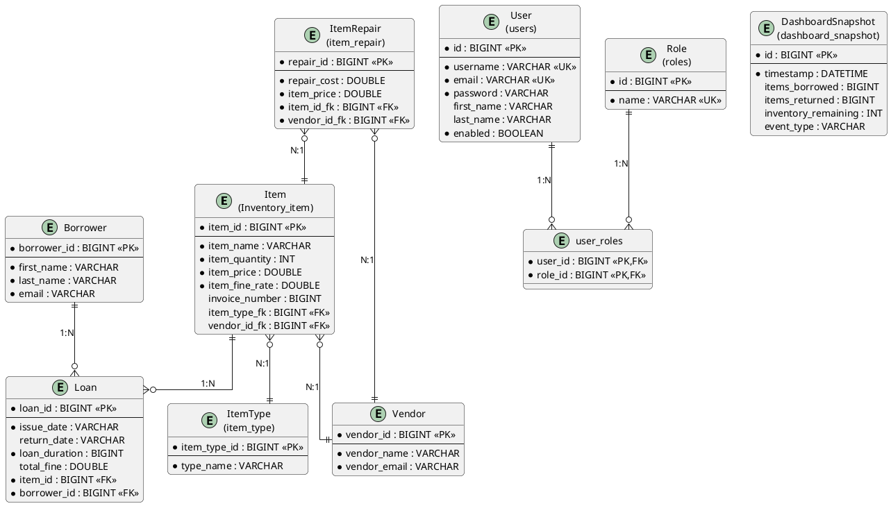

# 🗄️ FlowTrack Database Schema & Entity Relationship Documentation

## 📊 Document Overview

**Project:** FlowTrack - Inventory Management System  
**Database:** MySQL 8.0  
**ORM Framework:** JPA/Hibernate  
**Total Entities:** 11  
**Last Updated:** February 6, 2026  

---

## 🎯 Database Design Philosophy

The FlowTrack database follows a **normalized relational design** pattern with clear separation of concerns:

- **Core Business Logic:** Item, Borrower, Loan (lending workflow)
- **Organizational Data:** Vendor, ItemType, ItemRepair (supply chain)
- **Authentication & Authorization:** User, Role (Spring Security)
- **Analytics:** DashboardSnapshot (time-series metrics)
- **Legacy:** InventoryManager, ManagerType (deprecated)

**Design Principles:**
1. ✅ **Normalization** - Minimize data redundancy
2. ✅ **Referential Integrity** - Foreign key constraints
3. ✅ **Lazy Loading** - Performance optimization for related entities
4. ✅ **Cascading** - Proper cascade rules for relationships
5. ✅ **Soft Delete Ready** - Can add `deleted` flag without schema changes

---

## 📚 Entity Catalog

| Entity | Table Name | Purpose | Status | Relationships |
|--------|------------|---------|--------|---------------|
| **Item** | `Inventory_item` | Physical inventory items | ✅ Active | → ItemType, Vendor, Loan |
| **Borrower** | `Borrower` | People borrowing items | ✅ Active | → Loan |
| **Loan** | `Loan` | Borrowing transactions | ✅ Active | → Item, Borrower |
| **User** | `users` | System users (staff) | ✅ Active | → Role |
| **Role** | `roles` | Access control roles | ✅ Active | ← User |
| **Vendor** | `Vendor` | Item suppliers | ✅ Active | ← Item, ItemRepair |
| **ItemType** | `item_type` | Item categories | ✅ Active | ← Item |
| **ItemRepair** | `item_repair` | Damaged item repairs | ✅ Active | → Item, Vendor |
| **DashboardSnapshot** | `dashboard_snapshot` | Analytics snapshots | ✅ Active | Standalone |
| **InventoryManager** | `Inventory_Manager` | Old auth system | ⚠️ Legacy | → ManagerType |
| **ManagerType** | `manager_type` | Old manager types | ⚠️ Legacy | ← InventoryManager |

---

## 📖 Entity Detailed Documentation

### 1️⃣ **Item** (Core Entity)

**Table Name:** `Inventory_item`  
**Purpose:** Represents physical items available for lending

#### **Schema:**
```java
@Entity
@Table(name = "Inventory_item")
public class Item {
    @Id @GeneratedValue
    @Column(name = "item_id")
    private long id;                    // Primary Key
    
    @Column(name = "item_name")
    private String name;                // Item name (e.g., "Laptop")
    
    @Column(name = "item_quantity")
    private int quantity;               // Available stock
    
    @Column(name = "item_price")
    private double price;               // Purchase price (₹)
    
    @Column(name = "item_fine_rate")
    private double fineRate;            // Late fee per day (₹)
    
    @Column(name = "item_invoice_number")
    private long invoiceNumber;         // Purchase invoice reference
    
    // Relationships
    @OneToOne(fetch = LAZY)
    @JoinColumn(name = "item_type_fk")
    private ItemType itemType;          // FK → item_type
    
    @OneToOne(fetch = LAZY)
    @JoinColumn(name = "vendor_id_fk")
    private Vendor vendor;              // FK → Vendor
    
    @OneToMany(mappedBy = "item")
    private List<Loan> loan;            // One item, many loans
}
```

#### **Design Rationale:**

**Why separate `quantity` and `price`?**
- `quantity`: Tracks availability (decreases on issue, increases on return)
- `price`: Stores item value for loss/damage calculations

**Why store `fineRate` per item instead of global?**
- Expensive items (laptop) need higher fines than cheap items (pen)
- Flexibility to adjust fine rates per item

**Why `invoiceNumber` as `long` not `String`?**
- Numeric invoices are standard in accounting systems
- Enables sorting and range queries
- Future: Can migrate to String if alphanumeric needed

**Why OneToOne with ItemType instead of ManyToOne?**
- **Current:** Each item has one type, type can belong to multiple items
- **Issue:** This should be `@ManyToOne` (multiple items → one type)
- **Legacy Decision:** Likely a modeling error, works but not optimal
- **Fix Required:** Change to `@ManyToOne` in future refactor

**Business Methods:**
```java
decreaseQuantity()  // Called when item issued
increaseQuantity()  // Called when item returned
addLoan(Loan)       // Bidirectional relationship helper
removeLoan(Loan)    // Cleanup helper
```

#### **Evolution History:**
1. **Initial:** Simple item table with name and quantity
2. **v1.1:** Added `price` and `invoiceNumber` for procurement tracking
3. **v1.2:** Added `fineRate` for flexible fine calculation
4. **v1.3:** Added relationships to `ItemType` and `Vendor`

---

### 2️⃣ **Borrower** (Core Entity)

**Table Name:** `Borrower`  
**Purpose:** Individuals who borrow items (students, employees, customers)

#### **Schema:**
```java
@Entity
@Table(name = "Borrower")
public class Borrower {
    @Id @GeneratedValue
    @Column(name = "borrower_id")
    private long id;                    // Primary Key
    
    @Column(name = "first_name")
    private String firstName;           // Given name
    
    @Column(name = "last_name")
    private String lastName;            // Family name
    
    @Column(name = "email")
    private String email;               // Contact email
    
    // Relationships
    @OneToMany(mappedBy = "borrower")
    private List<Loan> loan;            // Borrowing history
}
```

#### **Design Rationale:**

**Why separate entity from `User`?**
- **Borrower**: External people who borrow items (students, customers)
- **User**: Internal staff who operate the system (admin, staff, manager)
- **Separation of Concerns**: Different authentication needs

**Why no username/password?**
- Borrowers don't log into the system
- Staff issues items on their behalf
- Email is sufficient for identification

**Why no phone number?**
- **Initial Design:** Minimal fields
- **Future Enhancement:** Should add `phone`, `studentId`, `department`

**Why no address?**
- Not needed for current use case (on-premises system)
- Can add if mailing receipts/notices needed

**Business Methods:**
```java
totalFine()           // Sum all unpaid fines across loans
updateFine(amount)    // Pay off fines (oldest first)
addLoan(Loan)         // Add new borrowing record
removeLoan(Loan)      // Remove borrowing record
```

#### **Evolution History:**
1. **Initial:** Basic borrower with name and email
2. **v1.1:** Added relationship to `Loan`
3. **v1.2:** Added fine calculation methods

---

### 3️⃣ **Loan** (Core Transaction Entity)

**Table Name:** `Loan`  
**Purpose:** Records item lending transactions (issuance and return)

#### **Schema:**
```java
@Entity
@Table(name = "Loan")
public class Loan {
    @Id @GeneratedValue
    @Column(name = "loan_id")
    private long id;                    // Primary Key
    
    @Column(name = "issue_date")
    private String issueDate;           // When item was issued (YYYY-MM-DD)
    
    @Column(name = "return_date")
    private String returnDate;          // When item was returned (nullable)
    
    @Column(name = "loan_duration")
    private long loanDuration;          // Expected loan period (days)
    
    @Column(name = "total_fine")
    private double totalFine;           // Late return fine (₹)
    
    // Relationships
    @ManyToOne(fetch = LAZY)
    private Item item;                  // FK → Item
    
    @ManyToOne(fetch = LAZY)
    private Borrower borrower;          // FK → Borrower
}
```

#### **Design Rationale:**

**Why dates as `String` instead of `Date`/`LocalDate`?**
- **Current:** String format "YYYY-MM-DD"
- **Issue:** No database-level date validation, harder to query
- **Reason:** Likely early design decision for simplicity
- **Fix Required:** Migrate to `LocalDate` in future
- **Workaround:** Helper class converts String ↔ Date

**Why `loanDuration` separate from dates?**
- Stores **expected** duration (policy limit)
- Due date = issueDate + loanDuration
- Allows flexible policies (7 days for books, 14 days for laptops)

**Why `totalFine` stored instead of calculated?**
- **Performance:** Avoid calculation on every query
- **Audit Trail:** Fine amount at time of transaction
- **Business Rule:** Fine can be manually adjusted (waived, increased)

**Why nullable `returnDate`?**
- `NULL` = item still borrowed (loan active)
- Not `NULL` = item returned (loan completed)
- Simple status tracking without separate status field

**Fine Calculation Logic:**
```java
calculateFine() {
    if (returnDate != null) {
        daysLate = returnDate - (issueDate + loanDuration)
        if (daysLate > 0) {
            fineRate = item.itemType == "High Precedence" 
                       ? highPrecedenceFineRate 
                       : lowPrecedenceFineRate
            totalFine = daysLate * fineRate
        }
    }
}
```

**Why two fine rates?**
- **High Precedence:** Critical items (laptops, projectors) = ₹50/day
- **Low Precedence:** Common items (pens, books) = ₹10/day
- **Future:** Should move to `fineRate` per item (already added!)

#### **Evolution History:**
1. **Initial:** Basic loan with item, borrower, dates
2. **v1.1:** Added `loanDuration` for flexible policies
3. **v1.2:** Added `totalFine` and fine calculation
4. **v1.3:** Added precedence-based fine rates

---

### 4️⃣ **User** (Authentication Entity)

**Table Name:** `users`  
**Purpose:** System users (admin, staff, managers) who operate the application

#### **Schema:**
```java
@Entity
@Table(name = "users")
public class User {
    @Id @GeneratedValue
    private Long id;                    // Primary Key
    
    @NotBlank @Column(unique = true)
    private String username;            // Login username
    
    @Email @Column(unique = true)
    private String email;               // Email address
    
    @NotBlank
    private String password;            // Hashed password (BCrypt)
    
    @Column(name = "first_name")
    private String firstName;           // Given name (optional)
    
    @Column(name = "last_name")
    private String lastName;            // Family name (optional)
    
    @Column(nullable = false)
    private boolean enabled = true;     // Account active status
    
    // Relationships
    @ManyToMany(fetch = EAGER)
    @JoinTable(
        name = "user_roles",
        joinColumns = @JoinColumn(name = "user_id"),
        inverseJoinColumns = @JoinColumn(name = "role_id")
    )
    private Set<Role> roles;            // User's assigned roles
}
```

#### **Design Rationale:**

**Why separate from `Borrower`?**
- **User**: Internal staff (authenticate, manage system)
- **Borrower**: External people (tracked, don't log in)
- **Different Needs**: Users need passwords, Borrowers don't

**Why separate from `InventoryManager`?**
- **New System:** Spring Security-based RBAC
- **Old System:** Custom auth (InventoryManager)
- **Migration:** Moved to industry-standard Spring Security

**Why `username` AND `email` both unique?**
- Username: Short, memorable login (e.g., "john_doe")
- Email: Contact info, password reset
- Both unique: Prevents conflicts

**Why `enabled` boolean?**
- Soft delete alternative
- Disable accounts without data loss
- Can re-enable later
- Audit trail preserved

**Why ManyToMany with Role?**
- One user can have multiple roles
- One role belongs to many users
- Join table `user_roles` stores relationships

**Why EAGER fetch for roles?**
- Roles needed immediately on user load
- Authorization checks happen frequently
- Small data size (typically 1-3 roles per user)
- Avoids LazyInitializationException

#### **Evolution History:**
1. **Initial:** InventoryManager with single manager type
2. **v2.0:** Complete rewrite to Spring Security
3. **v2.1:** Added User-Role ManyToMany
4. **v2.2:** Added `enabled` flag
5. **v2.3:** Added validation annotations

---

### 5️⃣ **Role** (Authorization Entity)

**Table Name:** `roles`  
**Purpose:** Define access control roles (ROLE_ADMIN, ROLE_MANAGER, etc.)

#### **Schema:**
```java
@Entity
@Table(name = "roles")
public class Role {
    @Id @GeneratedValue
    private Long id;                    // Primary Key
    
    @Column(unique = true, nullable = false)
    private String name;                // Role name (e.g., "ROLE_ADMIN")
}
```

#### **Design Rationale:**

**Why separate table for roles?**
- **Reusability:** Same role assigned to many users
- **Centralized Management:** Change role permissions centrally
- **Spring Security Standard:** Follows Spring Security conventions

**Why "ROLE_" prefix?**
- **Spring Security Convention:** Required by framework
- Framework automatically checks authorities with this prefix
- Example: `hasRole('ADMIN')` checks for `ROLE_ADMIN`

**Current Roles:**
1. **ROLE_USER** - Basic borrowing access
2. **ROLE_STAFF** - Process loans/returns
3. **ROLE_MANAGER** - Manage inventory, vendors
4. **ROLE_ADMIN** - Full system access, user management

**Why simple design (only name)?**
- **Roles = Labels:** Permissions defined in code, not DB
- **Code-based Security:** `@PreAuthorize("hasRole('ADMIN')")`
- **Flexibility:** Easy to add new roles

**Future Enhancements:**
- Add `permissions` table (fine-grained permissions)
- Example: ROLE_ADMIN → [CREATE_USER, DELETE_USER, VIEW_REPORTS]

#### **Evolution History:**
1. **Initial:** Single "ManagerType" (basic/advanced)
2. **v2.0:** Migrated to Spring Security roles
3. **v2.1:** Added 4 distinct roles
4. **v2.2:** Implemented hierarchical access

---

### 6️⃣ **Vendor** (Organizational Entity)

**Table Name:** `Vendor`  
**Purpose:** Suppliers who provide inventory items

#### **Schema:**
```java
@Entity
@Table(name = "Vendor")
public class Vendor {
    @Id @GeneratedValue
    @Column(name = "vendor_id")
    private long id;                    // Primary Key
    
    @Column(name = "vendor_name")
    private String name;                // Vendor company name
    
    @Column(name = "vendor_email")
    private String email;               // Vendor contact email
}
```

#### **Design Rationale:**

**Why track vendors?**
- **Procurement Management:** Know where items came from
- **Repair Tracking:** Send damaged items back to vendor
- **Reporting:** Analyze vendor reliability, costs
- **Business Intelligence:** Best suppliers, cost optimization

**Why minimal fields?**
- **MVP Approach:** Start simple
- **Future:** Add phone, address, contract terms, ratings

**Why no relationship to Item directly visible here?**
- **Item** has `@OneToOne` to Vendor
- Unidirectional relationship (Item → Vendor)
- Vendor doesn't need to know its items in memory

**Missing but useful fields:**
- `phone` - Contact number
- `address` - Physical location
- `contractStartDate` - Agreement period
- `contractEndDate` - Renewal tracking
- `rating` - Vendor performance score
- `status` - Active/Inactive

#### **Evolution History:**
1. **Initial:** Basic vendor with name
2. **v1.1:** Added email
3. **v1.2:** Linked to Item and ItemRepair

---

### 7️⃣ **ItemType** (Classification Entity)

**Table Name:** `item_type`  
**Purpose:** Categorize items (Electronics, Furniture, Stationary)

#### **Schema:**
```java
@Entity
@Table(name = "item_type")
public class ItemType {
    @Id @GeneratedValue
    @Column(name = "item_type_id")
    private long id;                    // Primary Key
    
    @Column(name = "type_name")
    private String typeName;            // Category name
}
```

#### **Design Rationale:**

**Why separate table?**
- **Normalization:** Avoid repeating "Electronics" in every item
- **Consistency:** Standardized categories
- **Reporting:** Group items by type
- **Fine Rate Logic:** Type determines fine precedence

**Current Types:**
1. **Electronics** - Laptops, monitors, keyboards
2. **Furniture** - Chairs, desks, cabinets
3. **Stationary** - Pens, notebooks, staplers
4. **High Precedence** - Critical items (affects fine rate)
5. **Low Precedence** - Common items (lower fine rate)

**Why "High/Low Precedence" as types?**
- **Business Logic:** Fine calculation uses type
- **Issue:** Mixing classification (what) with priority (how important)
- **Better Design:** Add `precedence` field to ItemType
- **Current Workaround:** Works but not ideal

**Future Improvements:**
```java
@Column
private String precedence;           // "HIGH", "MEDIUM", "LOW"

@Column
private double fineRate;             // Per-type fine rate

@Column
private String description;          // Type details
```

#### **Evolution History:**
1. **Initial:** Hardcoded types in code
2. **v1.1:** Moved to database table
3. **v1.2:** Added precedence types for fines
4. **v1.3:** Used in fine calculation logic

---

### 8️⃣ **ItemRepair** (Operations Entity)

**Table Name:** `item_repair`  
**Purpose:** Track damaged items sent for repair

#### **Schema:**
```java
@Entity
@Table(name = "item_repair")
public class ItemRepair {
    @Id @GeneratedValue
    @Column(name = "repair_id")
    private long id;                    // Primary Key
    
    @Column(name = "repair_cost")
    private double cost;                // Repair cost (₹)
    
    @Column(name = "item_price")
    private double price;               // Original item price (₹)
    
    // Relationships
    @OneToOne(fetch = LAZY)
    @JoinColumn(name = "item_id_fk")
    private Item item;                  // FK → Item
    
    @OneToOne(fetch = LAZY)
    @JoinColumn(name = "vendor_id_fk")
    private Vendor vendor;              // FK → Vendor (repair service)
}
```

#### **Design Rationale:**

**Why separate from `Item`?**
- **Not all items get repaired:** Most items never need repair
- **Historical Tracking:** One item can have multiple repairs over time
- **Issue:** OneToOne prevents multiple repairs per item!
- **Fix Required:** Change to @ManyToOne (one item, many repairs)

**Why store both `cost` and `price`?**
- `price`: Original item value (context for cost analysis)
- `cost`: Actual repair cost
- **Decision Logic:** If `cost > 0.7 * price`, consider replacement

**Why link to Vendor?**
- Items sent to original vendor for warranty repair
- Or third-party repair shops tracked as vendors
- Cost analysis by repair vendor

**Missing Critical Fields:**
- `repairDate` - When repair was done
- `returnDate` - When item returned from repair
- `status` - PENDING, IN_REPAIR, COMPLETED, CANCELLED
- `damageDescription` - What's broken
- `notes` - Repair notes

**Current Issues:**
1. **OneToOne Limitation:** Can't track multiple repairs per item
2. **No Status:** Don't know if repair is pending or done
3. **No Dates:** Can't track repair duration

**Recommended Schema Update:**
```java
@ManyToOne  // Change from OneToOne!
private Item item;

@Column
private String status;  // PENDING, IN_PROGRESS, COMPLETED

@Column
private LocalDate repairDate;

@Column
private LocalDate returnDate;

@Column(length = 500)
private String damageDescription;
```

#### **Evolution History:**
1. **Initial:** Basic repair with cost
2. **v1.1:** Added relationship to Item and Vendor
3. **v1.2:** Added item price for comparison
4. **Future:** Need to change OneToOne → ManyToOne

---

### 9️⃣ **DashboardSnapshot** (Analytics Entity)

**Table Name:** `dashboard_snapshot`  
**Purpose:** Time-series data for dashboard charts and analytics

#### **Schema:**
```java
@Entity
@Table(name = "dashboard_snapshot")
public class DashboardSnapshot {
    @Id @GeneratedValue
    private Long id;                    // Primary Key
    
    @Column
    private LocalDateTime timestamp;    // When snapshot was taken
    
    @Column
    private long itemsBorrowed;         // Cumulative loans
    
    @Column
    private long itemsReturned;         // Cumulative returns
    
    @Column
    private int inventoryRemaining;     // Current stock level
    
    @Column
    private long itemsIssued;           // Count of issued items
    
    @Column
    private String eventType;           // Event trigger
}
```

#### **Design Rationale:**

**Why snapshot vs. calculated?**
- **Performance:** Pre-calculated data loads faster
- **Historical Tracking:** Preserve state at specific times
- **Trend Analysis:** Compare today vs. last week
- **Dashboard Speed:** No complex joins/calculations on page load

**When snapshots are created:**
- **Event-Driven:** On item issue, return, add
- **Scheduled:** Daily midnight snapshot
- **On-Demand:** Admin triggers manual snapshot

**Why `eventType`?**
```
"ITEM_ADDED"      - New item added to inventory
"ITEM_ISSUED"     - Item loaned out
"ITEM_RETURNED"   - Item returned
"DAILY_SNAPSHOT"  - Scheduled snapshot
```

**Use Cases:**
1. **Dashboard Charts:** Plot items borrowed over time
2. **Trend Analysis:** Busiest days, peak usage
3. **Capacity Planning:** Predict inventory needs
4. **Reporting:** Monthly/yearly summaries

**Data Retention:**
- Keep daily snapshots: 90 days
- Keep weekly summaries: 1 year
- Keep monthly summaries: Forever

**Query Example:**
```sql
-- Last 7 days trend
SELECT DATE(timestamp), itemsBorrowed, itemsReturned
FROM dashboard_snapshot
WHERE timestamp >= NOW() - INTERVAL 7 DAY
  AND eventType = 'DAILY_SNAPSHOT'
ORDER BY timestamp;
```

#### **Evolution History:**
1. **Initial:** Real-time calculations (slow)
2. **v1.5:** Added snapshot table for performance
3. **v1.6:** Added event-driven snapshots
4. **v1.7:** Added scheduled daily snapshots

---

### 🔟 **InventoryManager** (Legacy Entity) ⚠️

**Table Name:** `Inventory_Manager`  
**Purpose:** Old authentication system (replaced by User-Role)  
**Status:** ⚠️ **DEPRECATED - DO NOT USE**

#### **Schema:**
```java
@Entity
@Table(name = "Inventory_Manager")
public class InventoryManager {
    @Id @GeneratedValue
    private long id;
    
    private String name;
    private String email;
    private String password;            // ⚠️ Not hashed!
    
    @OneToOne(cascade = ALL)
    private ManagerType managerType;    // Basic/Advanced
}
```

#### **Why Deprecated:**

1. **Security Issues:**
   - Password not hashed (stored plain text!)
   - No proper password validation
   - No session management

2. **Limited Functionality:**
   - Only 2 types: Basic/Advanced
   - No fine-grained permissions
   - Can't assign multiple roles

3. **Not Industry Standard:**
   - Custom auth vs. Spring Security
   - Missing important features (remember-me, password reset)

**Migration Path:**
- All InventoryManager → User (with appropriate Role)
- Data migration script available
- Old tables kept for backward compatibility (temporarily)

**Do NOT:**
- ❌ Create new InventoryManager records
- ❌ Update existing InventoryManager
- ❌ Reference in new code

**Use Instead:**
- ✅ User entity
- ✅ Role-based access control
- ✅ Spring Security

#### **Removal Plan:**
1. **Phase 1:** All active managers migrated to User (DONE ✅)
2. **Phase 2:** Code references removed (IN PROGRESS 🚧)
3. **Phase 3:** Drop tables (FUTURE - after 6 months)

---

### 1️⃣1️⃣ **ManagerType** (Legacy Entity) ⚠️

**Table Name:** `manager_type`  
**Purpose:** Old manager categorization (replaced by Role)  
**Status:** ⚠️ **DEPRECATED - DO NOT USE**

#### **Schema:**
```java
@Entity
@Table(name = "manager_type")
public class ManagerType {
    @Id @GeneratedValue
    private long id;
    
    private String typeName;            // "Basic", "Advanced"
}
```

#### **Why Deprecated:**

1. **Too Simplistic:**
   - Only Basic/Advanced
   - No granular permissions

2. **Replaced by Role:**
   - 4 roles instead of 2 types
   - Spring Security integration
   - Industry-standard RBAC

**Migration:**
- `Basic` → `ROLE_STAFF` or `ROLE_USER`
- `Advanced` → `ROLE_MANAGER` or `ROLE_ADMIN`

**Removal Plan:**
Same as InventoryManager

---

## 🔗 Relationship Mapping

### **Relationship Summary Table:**

| From | To | Type | Cardinality | Foreign Key | Description |
|------|-----|------|-------------|-------------|-------------|
| Item | ItemType | OneToOne | Many:1 | `item_type_fk` | Each item has one type |
| Item | Vendor | OneToOne | Many:1 | `vendor_id_fk` | Each item from one vendor |
| Item | Loan | OneToMany | 1:Many | `item_id` | One item, many loans |
| Borrower | Loan | OneToMany | 1:Many | `borrower_id` | One borrower, many loans |
| Loan | Item | ManyToOne | Many:1 | (implicit) | Many loans for one item |
| Loan | Borrower | ManyToOne | Many:1 | (implicit) | Many loans by one borrower |
| User | Role | ManyToMany | Many:Many | `user_roles` join | Users have multiple roles |
| ItemRepair | Item | OneToOne | 1:1 | `item_id_fk` | ⚠️ Should be ManyToOne |
| ItemRepair | Vendor | OneToOne | Many:1 | `vendor_id_fk` | Repair vendor |
| InventoryManager | ManagerType | OneToOne | Many:1 | `manager_type_fk` | ⚠️ Legacy |

### **Key Relationships Explained:**

#### **Item ↔ Loan ↔ Borrower (Core Workflow)**

```
┌──────────┐      ┌──────────┐      ┌──────────┐
│   Item   │      │   Loan   │      │ Borrower │
│          │◄─────│          │─────►│          │
│ id       │1    N│ item_id  │N    1│ id       │
│ name     │      │ borrower │      │ name     │
│ quantity │      │ issue_dt │      │ email    │
└──────────┘      │ return_dt│      └──────────┘
                  └──────────┘
```

**How it works:**
1. Item has quantity = 10
2. Staff issues item to Borrower → Creates Loan record
3. Item.quantity decreases to 9
4. Loan stores: which item, which borrower, when
5. Borrower returns item → Loan.returnDate set
6. Item.quantity increases to 10
7. If late: Loan calculates fine

#### **User ↔ Role (Authentication)**

```
┌──────────┐                    ┌──────────┐
│   User   │                    │   Role   │
│          │                    │          │
│ id       │──┐            ┌───►│ id       │
│ username │  │            │    │ name     │
│ password │  │            │    └──────────┘
└──────────┘  │            │
              │            │
              │  ┌─────────┴────────┐
              │  │   user_roles     │
              └─►│ user_id          │
                 │ role_id          │
                 └──────────────────┘
```

**How it works:**
1. User created with username/password
2. Admin assigns roles: User → [ROLE_STAFF, ROLE_USER]
3. user_roles join table stores relationships
4. On login: Spring Security loads user + roles
5. Authorization: Check if user has required role

#### **Item → ItemType (Classification)**

```
┌──────────┐      ┌──────────────┐
│   Item   │      │  ItemType    │
│          │─────►│              │
│ id       │N    1│ id           │
│ name     │      │ typeName     │
│ type_fk  │      │ (Electronics)│
└──────────┘      └──────────────┘
```

**Why OneToOne appears but acts like ManyToOne:**
- Code says `@OneToOne` but behavior is ManyToOne
- Many items can have same ItemType
- Legacy modeling decision

#### **Item → Vendor (Supply Chain)**

```
┌──────────┐      ┌──────────────┐
│   Item   │      │   Vendor     │
│          │─────►│              │
│ id       │N    1│ id           │
│ name     │      │ name         │
│ vendor_fk│      │ email        │
└──────────┘      └──────────────┘
```

**Tracks:**
- Which vendor supplied the item
- Invoice number for procurement
- Useful for: Reordering, warranty claims, vendor analysis

---

## 📐 PlantUML ER Diagram

### **Complete Database Schema:**

```plantuml
@startuml FlowTrack_ER_Diagram

!define TABLE(name) entity name << (T,#FFAAAA) >>
!define PRIMARY_KEY(x) <u>x</u>
!define FOREIGN_KEY(x) <i>x</i>

' Core Entities
TABLE(Item) {
  PRIMARY_KEY(item_id) : BIGINT
  --
  item_name : VARCHAR(255)
  item_quantity : INT
  item_price : DOUBLE
  item_fine_rate : DOUBLE
  item_invoice_number : BIGINT
  FOREIGN_KEY(item_type_fk) : BIGINT
  FOREIGN_KEY(vendor_id_fk) : BIGINT
}

TABLE(Borrower) {
  PRIMARY_KEY(borrower_id) : BIGINT
  --
  first_name : VARCHAR(255)
  last_name : VARCHAR(255)
  email : VARCHAR(255)
}

TABLE(Loan) {
  PRIMARY_KEY(loan_id) : BIGINT
  --
  issue_date : VARCHAR(50)
  return_date : VARCHAR(50)
  loan_duration : BIGINT
  total_fine : DOUBLE
  FOREIGN_KEY(item_id) : BIGINT
  FOREIGN_KEY(borrower_id) : BIGINT
}

' Classification
TABLE(ItemType) {
  PRIMARY_KEY(item_type_id) : BIGINT
  --
  type_name : VARCHAR(255)
}

' Supply Chain
TABLE(Vendor) {
  PRIMARY_KEY(vendor_id) : BIGINT
  --
  vendor_name : VARCHAR(255)
  vendor_email : VARCHAR(255)
}

TABLE(ItemRepair) {
  PRIMARY_KEY(repair_id) : BIGINT
  --
  repair_cost : DOUBLE
  item_price : DOUBLE
  FOREIGN_KEY(item_id_fk) : BIGINT
  FOREIGN_KEY(vendor_id_fk) : BIGINT
}

' Authentication & Authorization
TABLE(User) {
  PRIMARY_KEY(id) : BIGINT
  --
  username : VARCHAR(255) UNIQUE
  email : VARCHAR(255) UNIQUE
  password : VARCHAR(255)
  first_name : VARCHAR(255)
  last_name : VARCHAR(255)
  enabled : BOOLEAN
}

TABLE(Role) {
  PRIMARY_KEY(id) : BIGINT
  --
  name : VARCHAR(50) UNIQUE
}

TABLE(user_roles) {
  FOREIGN_KEY(user_id) : BIGINT
  FOREIGN_KEY(role_id) : BIGINT
  --
  PRIMARY_KEY(user_id, role_id)
}

' Analytics
TABLE(DashboardSnapshot) {
  PRIMARY_KEY(id) : BIGINT
  --
  timestamp : DATETIME
  items_borrowed : BIGINT
  items_returned : BIGINT
  inventory_remaining : INT
  items_issued : BIGINT
  event_type : VARCHAR(50)
}

' Legacy (Deprecated)
TABLE(InventoryManager) {
  PRIMARY_KEY(manager_id) : BIGINT
  --
  manager_name : VARCHAR(255)
  manager_email : VARCHAR(255)
  manager_password : VARCHAR(255)
  FOREIGN_KEY(manager_type_fk) : BIGINT
  ..
  <<DEPRECATED>>
}

TABLE(ManagerType) {
  PRIMARY_KEY(manager_type_id) : BIGINT
  --
  manager_type_name : VARCHAR(255)
  ..
  <<DEPRECATED>>
}

' Relationships - Core Workflow
Item ||--o{ Loan : "has many loans"
Borrower ||--o{ Loan : "has many loans"
Item }o--|| ItemType : "has one type"
Item }o--|| Vendor : "supplied by"

' Relationships - Repair
ItemRepair }o--|| Item : "repairs"
ItemRepair }o--|| Vendor : "repair vendor"

' Relationships - Auth
User }o--o{ Role : "has roles"
(User, Role) .. user_roles

' Relationships - Legacy
InventoryManager }o--|| ManagerType : "has type"

' Notes
note right of Item
  **Core Entity**
  Tracks available inventory.
  Quantity decreases on issue,
  increases on return.
end note

note right of Loan
  **Transaction Entity**
  Records borrowing activity.
  returnDate NULL = still borrowed
  Calculates fines automatically.
end note

note right of User
  **Authentication**
  Replaced InventoryManager.
  Uses Spring Security.
  Password hashed with BCrypt.
end note

note right of DashboardSnapshot
  **Analytics**
  Time-series data for charts.
  Event-driven + scheduled.
end note

note right of InventoryManager
  **⚠️ DEPRECATED**
  Use User entity instead.
  Will be removed in future.
end note

@enduml
```

---

## 📊 Visual ER Diagram (Alternative - Simpler)



---

## 🎯 Relationship Cardinality Explained

| Relationship | Read As | Cardinality | Example |
|-------------|---------|-------------|----------|
| Item → ItemType | Each item has one type | Many-to-One | 100 laptops → 1 "Electronics" type |
| Item → Vendor | Each item from one vendor | Many-to-One | 50 items → 1 "Office Supplies Co" |
| Item → Loan | One item can have many loans | One-to-Many | 1 laptop → 25 loans (over time) |
| Borrower → Loan | One borrower can have many loans | One-to-Many | 1 student → 5 loans (active + history) |
| Loan → Item | Each loan for one item | Many-to-One | 100 loans → 1 specific laptop |
| Loan → Borrower | Each loan by one borrower | Many-to-One | 50 loans → 1 student (over time) |
| User ↔ Role | Users have multiple roles, roles assigned to many users | Many-to-Many | admin user → [ADMIN, MANAGER] roles |
| ItemRepair → Item | Each repair record for one item | OneToOne (should be ManyToOne) | 1 repair → 1 laptop |
| ItemRepair → Vendor | Each repair by one vendor | Many-to-One | 10 repairs → 1 "Tech Repair Shop" |

---

## 🔧 Schema Design Issues & Recommendations

### **Issue 1: Date Storage as String** ⚠️

**Current:**
```java
@Column
private String issueDate;  // "2026-02-06"
```

**Problem:**
- No database-level validation
- Harder to query (date ranges, sorting)
- String comparison vs. date comparison
- Time zone issues

**Recommendation:**
```java
@Column
private LocalDate issueDate;  // Proper Java 8 Date

// For timestamps
@Column
private LocalDateTime createdAt;
```

**Migration Script:**
```sql
ALTER TABLE Loan
  MODIFY COLUMN issue_date DATE;

UPDATE Loan
  SET issue_date = STR_TO_DATE(issue_date, '%Y-%m-%d');
```

---

### **Issue 2: ItemRepair OneToOne Relationship** ⚠️

**Current:**
```java
@OneToOne
private Item item;  // Can only track one repair per item!
```

**Problem:**
- Can't track multiple repairs for same item
- Historical data lost
- Need repair history for analytics

**Recommendation:**
```java
@ManyToOne  // Many repairs for one item
private Item item;
```

**Impact:**
- No data loss (existing repairs preserved)
- Can now add multiple repairs per item
- Better repair history tracking

---

### **Issue 3: Item-ItemType Relationship Confusion** ⚠️

**Current:**
```java
@OneToOne  // Misleading annotation
private ItemType itemType;
```

**Reality:**
- Multiple items share one ItemType
- Behaves like ManyToOne

**Recommendation:**
```java
@ManyToOne(fetch = LAZY)
@JoinColumn(name = "item_type_fk")
private ItemType itemType;
```

---

### **Issue 4: Missing Timestamps** ⚠️

**Current:**
- No `createdAt`, `updatedAt` fields

**Problem:**
- Can't audit when records created/modified
- Can't track data history
- Hard to debug issues

**Recommendation:**
Add to all entities:
```java
@Column(updatable = false)
@CreationTimestamp
private LocalDateTime createdAt;

@Column
@UpdateTimestamp
private LocalDateTime updatedAt;
```

---

### **Issue 5: No Soft Delete Support** ⚠️

**Current:**
- Hard delete only (data lost permanently)

**Problem:**
- Can't restore accidentally deleted records
- Audit trail broken
- Relationships break

**Recommendation:**
Add to all entities:
```java
@Column
private boolean deleted = false;

@Column
private LocalDateTime deletedAt;
```

Then use:
```java
@Where(clause = "deleted = false")  // JPA filter
```

---

### **Issue 6: Missing Indexes** ⚠️

**Current:**
- Only primary keys indexed

**Problem:**
- Slow queries on frequently searched fields
- Poor performance on large datasets

**Recommendation:**
```java
@Table(name = "Borrower", indexes = {
    @Index(name = "idx_borrower_email", columnList = "email"),
    @Index(name = "idx_borrower_name", columnList = "first_name, last_name")
})

@Table(name = "Loan", indexes = {
    @Index(name = "idx_loan_dates", columnList = "issue_date, return_date"),
    @Index(name = "idx_loan_borrower", columnList = "borrower_id"),
    @Index(name = "idx_loan_item", columnList = "item_id")
})

@Table(name = "Item", indexes = {
    @Index(name = "idx_item_name", columnList = "item_name"),
    @Index(name = "idx_item_type", columnList = "item_type_fk")
})
```

---

## 📈 Future Schema Enhancements

### **Phase 1: Payment Gateway**
```java
@Entity
public class Payment {
    @Id @GeneratedValue
    private Long id;
    
    @ManyToOne
    private Loan loan;  // Which loan's fine
    
    private BigDecimal amount;
    private String transactionId;
    private String paymentMethod;  // CARD, UPI, WALLET
    private String status;  // PENDING, SUCCESS, FAILED
    private LocalDateTime paymentDate;
}
```

### **Phase 2: Notifications**
```java
@Entity
public class Notification {
    @Id @GeneratedValue
    private Long id;
    
    @ManyToOne
    private User user;
    
    private String type;  // LOAN_DUE, FINE_CHARGED, ITEM_RETURNED
    private String message;
    private boolean read;
    private LocalDateTime createdAt;
}
```

### **Phase 3: Reservations**
```java
@Entity
public class Reservation {
    @Id @GeneratedValue
    private Long id;
    
    @ManyToOne
    private Item item;
    
    @ManyToOne
    private Borrower borrower;
    
    private LocalDate startDate;
    private LocalDate endDate;
    private String status;  // PENDING, CONFIRMED, CANCELLED
}
```

### **Phase 4: Audit Trail**
```java
@Entity
public class AuditLog {
    @Id @GeneratedValue
    private Long id;
    
    @ManyToOne
    private User user;  // Who made the change
    
    private String entityType;  // Item, Loan, User, etc.
    private Long entityId;
    private String action;  // CREATE, UPDATE, DELETE
    private String oldValue;
    private String newValue;
    private LocalDateTime timestamp;
}
```

---

## 📚 Schema Evolution History

### **Version 1.0 (Initial - Academic Project)**
- Core entities: Item, Borrower, Loan
- Simple authentication: InventoryManager
- Basic fields only

### **Version 1.1 (Feature Additions)**
- Added: Vendor, ItemType
- Enhanced Item with price, invoice, fine rate
- Added fine calculation

### **Version 1.2 (Repair Tracking)**
- Added: ItemRepair
- Linked repairs to vendors

### **Version 1.3 (Advanced Fines)**
- Added precedence-based fines
- ItemType drives fine calculation

### **Version 2.0 (Spring Security Migration) ✅**
- **Major Refactor:** InventoryManager → User + Role
- Implemented proper RBAC
- Password hashing with BCrypt
- ManyToMany user-role relationship

### **Version 2.1 (Analytics)**
- Added: DashboardSnapshot
- Time-series data collection
- Event-driven snapshots

### **Version 2.2 (Current - Production Ready)**
- All core features stable
- Ready for Phase 2 enhancements
- Documentation complete

### **Version 3.0 (Planned - Payment Gateway)**
- Add: Payment entity
- Integrate Stripe/Razorpay
- Online fine payment

### **Version 3.1 (Planned - Notifications)**
- Add: Notification entity
- Email/SMS integration
- In-app notifications

### **Version 4.0 (Planned - Advanced Features)**
- Add: Reservation entity
- Waiting list functionality
- Item bundles/kits

---

## ✅ Best Practices Applied

### **✅ Normalization:**
- No redundant data
- Separate tables for distinct entities
- Proper foreign key relationships

### **✅ Naming Conventions:**
- Clear, descriptive names
- Consistent prefixes (`item_`, `borrower_`)
- Following JPA conventions

### **✅ Lazy Loading:**
- Relationships marked `LAZY` by default
- Avoids N+1 query problems
- Load related entities only when needed

### **✅ Bidirectional Relationships:**
- Helper methods (`addLoan`, `removeLoan`)
- Maintains consistency automatically

### **✅ Business Logic in Models:**
- `calculateFine()` in Loan
- `totalFine()` in Borrower
- `decreaseQuantity()` in Item

---

## 🎓 Summary

**Total Entities:** 11 (9 active, 2 deprecated)

**Core Business:**
- **Item** - What can be borrowed
- **Borrower** - Who borrows
- **Loan** - The transaction

**Supporting:**
- **ItemType** - Categorization
- **Vendor** - Supply chain
- **ItemRepair** - Maintenance
- **DashboardSnapshot** - Analytics

**Authentication:**
- **User** - System users (staff)
- **Role** - Access control

**Legacy:**
- **InventoryManager** - Old auth
- **ManagerType** - Old roles

**Total Tables:** 12 (11 entities + 1 join table `user_roles`)

**Lines of Code:** ~1,500 lines across all models

**Design Quality:** ⭐⭐⭐⭐ (4/5)
- Well-structured for MVP
- Some optimization needed
- Ready for production with Phase 2 enhancements

---

**Generated:** February 6, 2026  
**Author:** Database Architecture Team  
**Version:** 2.2  
**Status:** Complete ✅
